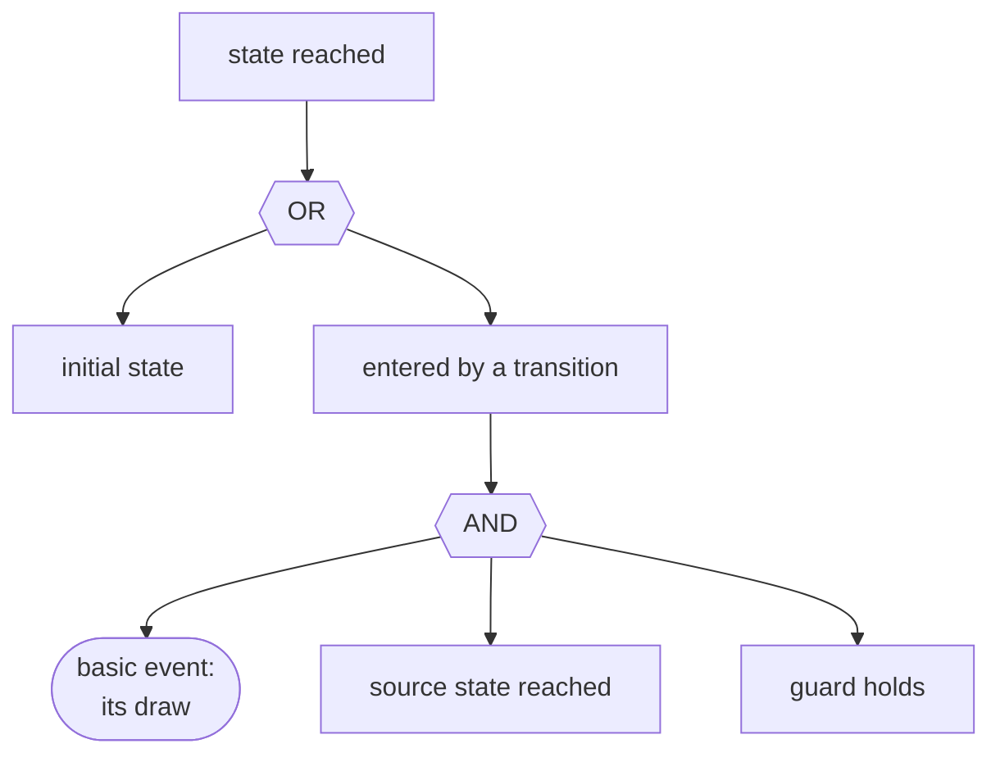
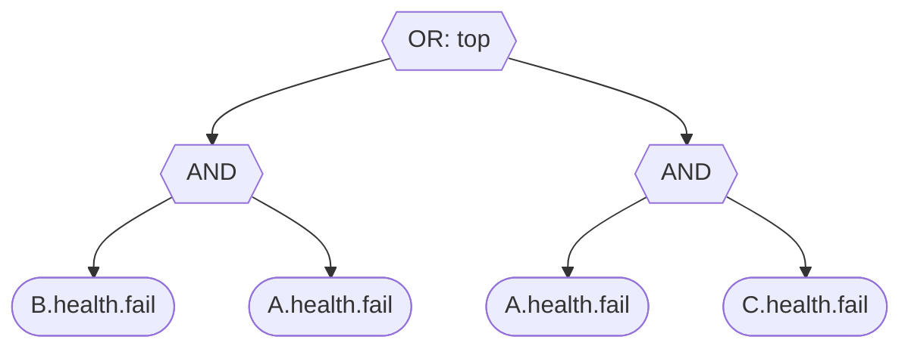
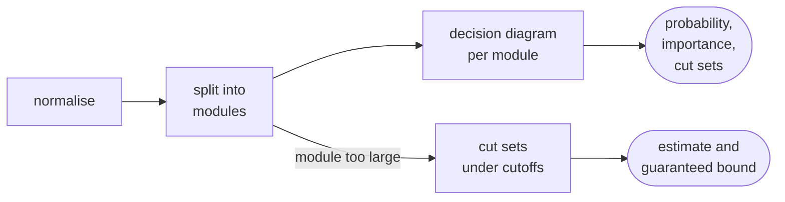

# Fault trees

`pyraichu.fault_tree` generates the fault tree explaining why a **top
expression** over the model, or one of the model's declared **targets** (the
feared events of a study, see [Trees from targets](#trees-from-targets)), can
become true, and hands it back as a tree, as its minimal cut sets, and as an
OpenPSA model-exchange document a static tool reads. `pyraichu.quantify` then computes the tree's exact
top-event probability, the importance of each basic event and its minimal cut
sets, for a generated tree or for any OpenPSA document (see
[Quantification](#quantification)).

```python
import pyraichu

def unit(name, guard=None):
    fail = {"name": "fail", "source": "ok", "targets": ["nok"],
            "distrib": "exp", "rate": 1e-3}
    if guard is not None:
        fail["guard"] = guard
    return {"name": name, "automata": [{"name": "health", "states": ["ok", "nok"],
                                        "init": "ok", "transitions": [fail]}]}

def nok(component):
    return {"op": "state_active",
            "state": {"component": component, "automaton": "health", "state": "nok"}}

# B fails only once A has; C fails on its own.
model = pyraichu.load_model({"name": "plant", "components": [
    unit("A"), unit("B", guard=nok("A")), unit("C")]})

top = {"op": "bool", "bool_op": "or",
       "args": [nok("B"), {"op": "bool", "bool_op": "and", "args": [nok("A"), nok("C")]}]}
tree = pyraichu.fault_tree(model, top)
assert tree.minimal_cut_sets == [["A.health.fail", "B.health.fail"],
                                 ["A.health.fail", "C.health.fail"]]
xml = tree.open_psa        # the OpenPSA document a static tool reads
```

## The method, and its hypothesis

The tree is built by **backward chaining**, the method of the reference
engine's own generator, under one hypothesis, which is the whole content of the
feature:

- only **states move**. A state is explained as being the initial one, OR as
  entered by one of the transitions into it; a transition is explained as its
  **basic event** (the draw of its law) AND its source state being reached AND
  its guard holding;
- an attribute a **sensitive function** or an **explicit equation** computes
  is **unrolled**: replaced by the expression that computes it, recursively,
  down to the states and to the attributes nothing writes. A flow variable of
  a model built through the muscadet layer is such an attribute, so a
  condition on the flows is explained by the failures that cut them;
- an attribute **nothing writes keeps its initial value**, or the value a
  `profile` gives it by qualified name (`profile={"B.x": 10.0}`); a profiled
  attribute is a constant, whatever computes it. A guard reading only such
  constants is therefore a constant: the transition is always possible, or
  never;
- negations are pushed down to the states: "not in `ok`" is "in one of the
  automaton's other states", which is how the loss of a flow becomes the
  failure states that cause it;
- a transition **no draw governs** (a delay of zero: an observer's, an
  instantaneous reconfiguration) fires as soon as its source and its guard
  hold, so it is **crossed** as those two and contributes no basic event.

One step of the chaining, applied recursively from the top expression down:



On the example, the tree it generates, whose two minimal cut sets are read off
the two AND gates:



A loop back to a state already being explained further up the same branch
adds no new way in, so a repair loop is handled rather than truncated: `nok`
is reached from `ok`, `ok` is initial, and the repair back to `ok` never
appears in the tree.

The gates are simplified as they are built: constants propagated,
single-child gates collapsed, nested gates of one connective merged. A vote is
written `sum(if(state, 1, 0)) >= k` and becomes an `at_least` gate (`atleast`
in the OpenPSA file).

## The result

`fault_tree` returns a `FaultTree` with five fields:

| field | content |
|---|---|
| `top` | the top gate, nested: `{"node": "gate", "gate": …, "k": …, "children": […]}` with `"gate"` one of `"and"`, `"or"`, `"at_least"`, or `{"node": "basic", "event": index}`; never a constant, a degenerate tree being refused (see [What is refused](#what-is-refused)) |
| `basic_events` | one entry per transition draw: `name`, `component`, `automaton`, `transition`, `target` and its `law` with the law's parameters; `event` in `top` indexes this list |
| `minimal_cut_sets` | each a sorted list of basic-event names, ordered by size then name; `None` when `cut_sets=False` |
| `open_psa` | the OpenPSA document (see [The file](#the-file)) |
| `warnings` | why the tree's probability may exceed the model's own, one sentence per transition concerned; empty when the tree is exact (see [What the number means](#what-the-number-means)) |

```python
assert tree.top["gate"] == "or"
assert [e["name"] for e in tree.basic_events] == ["A.health.fail", "B.health.fail", "C.health.fail"]
```

Set `cut_sets=False` to skip structural cut-set extraction. The default
remains `True`. A skipped collection is `None`, never an empty list; the
extraction budget cannot block generation when extraction is skipped.
`tree.structure()` returns the producer-owned `raichu.fault_tree.structure`
v1 document, containing the gates, basic events, generation warnings and
requested structural cuts without quantifying any probability. Read it with
`pyraichu.read_fault_tree_structure`.

```python
structure_only = pyraichu.fault_tree(model, top, cut_sets=False, cut_set_limit=0)
assert structure_only.minimal_cut_sets is None
document = structure_only.structure()
assert document["cut_sets_omitted"] == "not requested"
assert pyraichu.read_fault_tree_structure(document) == document
# Probability-only analysis also skips the quantifier's cut extraction.
probabilities = structure_only.envelope([1000.0], cut_sets=False)
assert probabilities["horizon"]["minimal_cut_sets"] is None
```

Three keywords bound the work and name the output:

- `max_nodes` (default 1 000 000): the tree is refused once it outgrows that
  many nodes, rather than exhausting the memory on a model whose explanation
  explodes;
- `cut_set_limit` (default 100 000): the same guard on the cut-set expansion;
- `name` (default `"fault_tree"`): the name of the `define-fault-tree` in the
  OpenPSA document.

Either limit being reached raises `SimulationError` naming it: raise it, or
explain a narrower top expression.

## Trees from targets

A study does not write a top expression: it declares **targets**, the feared
events whose occurrence ends a trajectory (the model's `targets` section, see
the model schema). `targets=[...]` explains them: the top is the disjunction of
the targets' states, and each is explained through the transition that enters
it. A feared event is an **observer** in the muscadet layer (a transition of
kind `observation`, a delay of zero, guarded by the event's condition on the
flows): it is crossed as its condition, unrolled down to the failures.

```python
import math

def block(name, rate):
    """A block whose `up` a function computes from its failure state."""
    return {"name": name,
            "attributes": [{"name": "up", "kind": "bool",
                            "init": {"kind": "bool", "value": False}}],
            "ports": [{"name": "out", "dir": "out", "attr": "up"}],
            "automata": [{"name": "health", "states": ["ok", "nok"], "init": "ok",
                          "transitions": [{"name": "fail", "source": "ok", "targets": ["nok"],
                                           "distrib": "exp", "rate": rate}]}],
            "sensitive_functions": [{"name": "update_up", "effects": [
                {"target": {"component": name, "attribute": "up"},
                 "value": {"op": "state_active",
                           "state": {"component": name, "automaton": "health", "state": "ok"}}}]}]}

fed = {"op": "attr", "attr": {"component": "T", "attribute": "fed"}}
lost = {"op": "cmp", "cmp": "eq", "lhs": fed,
        "rhs": {"op": "const", "value": {"kind": "bool", "value": False}}}
parallel = pyraichu.load_model({
    "name": "parallel",
    "components": [
        block("B1", 1e-3), block("B2", 2e-3),
        {"name": "T",          # fed while any block is up
         "attributes": [{"name": "fed", "kind": "bool",
                         "init": {"kind": "bool", "value": False}}],
         "ports": [{"name": "in", "dir": "in"}],
         "sensitive_functions": [{"name": "update_fed", "effects": [
             {"target": {"component": "T", "attribute": "fed"},
              "value": {"op": "port_agg", "port": {"component": "T", "port": "in"},
                        "agg": "any"}}]}]},
        {"name": "T_lost",     # the feared event, observing the target
         "automata": [{"name": "ev", "states": ["not_occ", "occ"], "init": "not_occ",
                       "transitions": [{"name": "occ", "source": "not_occ",
                                        "targets": ["occ"], "guard": lost,
                                        "kind": "observation",
                                        "distrib": "delay", "time": 0.0}]}]}],
    "connections": [{"from": {"component": b, "port": "out"},
                     "to": {"component": "T", "port": "in"}} for b in ("B1", "B2")],
    "targets": [{"name": "T_lost", "component": "T_lost",
                 "automaton": "ev", "state": "occ"}],
})

lost_tree = pyraichu.fault_tree(parallel, targets=["T_lost"])
assert lost_tree.minimal_cut_sets == [["B1.health.fail", "B2.health.fail"]]
assert lost_tree.warnings == []    # the exact structure: see below
lost = lost_tree.quantify(mission_time=1000.0)
assert abs(lost.probability - (1 - math.exp(-1)) * (1 - math.exp(-2))) < 1e-12
```

`T.fed` starts `false`, before the first fixpoint: frozen at that value, the
condition `not fed` would be the constant `true` and the tree would read one.
Unrolled, it is `not (B1 ok or B2 ok)`, that is `B1 nok and B2 nok`.

### What the number means

A basic event's probability is its law's distribution at the mission time,
with no repair: the tree gives the **probability without repair** that the
top holds at that time. That number is the model's own probability, the one
its simulation draws, exactly when every basic event is drawn from the start
of the mission independently of the others: a transition out of an initial
state, guarded by nothing that reads a state, competing with no other
transition, never undone by a repair. On such a model (a series, a parallel or
a voting structure of non-repairable components), RAICHU's Monte-Carlo of the
same model, each trajectory stopped at the target, lands on the tree's
probability within its confidence interval; the test suite checks it on each
of the three.

Where one of these does not hold, the tree **over-estimates**, and says where:
`warnings` holds one sentence per transition concerned.

| Warning | Why the tree is above the model |
|---|---|
| a repair the tree ignores | a repaired component is up again, the tree keeps it down: the tree is an upper bound of the first-occurrence probability with repairs |
| a failure guarded by a condition on states (a block that fails only while fed) | the tree times the draw from the start of the mission, the model from when the condition holds |
| a draw from a state entered during the mission (a degraded mode failing further) | same: the second draw starts later in the model |
| a transition competing with another from the same state | the tree lets each fire as if the other could not first |

On a coherent top, each of these can only add failures, so the tree remains an
upper bound. The empty list is the statement that the tree is exact.

### Forms of a muscadet model

What the generation does with each shape a muscadet study takes, measured on
systems muscadet 5.11.0 itself built:

| Shape | Class |
|---|---|
| boolean flows in series, in parallel, or into a `logic=k` vote; exponential or delay failure modes without repair | exact |
| the same with repairs; failure modes guarded by a flow (`failure_cond="is_ok_fed_out"`); a common-cause mode (`ObjFMExp` over several targets) with repairs | upper bound, with warnings |
| a feared event that waits before occurring (`tempo_occ > 0`) | refused: its state lags its condition |
| a standby on a trigger (`add_flow_out_on_trigger`) | refused: the loss needs the trigger to stay down, an order of events a static tree cannot carry |
| a feared event no failure can cause | refused: degenerate |

The sequences of a simulation (sequence analysis) are the tool for the
dynamic shapes. A tree is not those sequences, which order the events: the two
answer different questions.

### The envelope

`lost_tree.envelope(mission_times)` quantifies the tree at each of 1 to 20 strictly
increasing mission times and returns the `raichu.fault_tree` envelope, a
versioned document RAICHU produces: the probability at every instant, and at
the last one (the horizon) the minimal cut sets with their probabilities and
the importance of each basic event, beside the generation warnings and the
settings applied. Its schema is the
[fault-tree envelope format](../reference/fault-tree-format.md);
`pyraichu.read_fault_tree` checks a document's format and version before
reading it.

```python
envelope = lost_tree.envelope([100.0, 500.0, 1000.0])
assert envelope["format"] == "raichu.fault_tree" and envelope["version"] == 1
assert [i["mission_time"] for i in envelope["instants"]] == [100.0, 500.0, 1000.0]
assert envelope["horizon"]["minimal_cut_sets"][0]["order"] == 2
assert envelope["generation"]["exact"]
```

## What is refused

Every refusal raises `SimulationError` naming its cause, rather than handing
out a number that looks right:

- a **degenerate** tree: a top that reduces to a constant once unrolled, true
  from the initial state (no failure needed) or false (no failure can cause
  it, for instance a condition on attributes nothing computes from a state).
  Quantified, it would read one or zero; the message names the condition that
  came out constant;
- a top, or a feared event's condition, that needs a state the model can leave
  to **persist** (an initial state read positively once the negations are
  pushed down): a static tree explains states being entered, not kept;
- a state read inside arithmetic that is not a vote, and a transition whose
  rate reads a state;
- an attribute that **cannot be unrolled**: computed by an ODE, a transition's
  effect, a distribution operator, a linear block or a program, or written in
  two places, and a ring of attributes computing each other. Frozen, it would
  turn the conditions reading it into constants;
- an observer that waits before it fires.

## Quantification

`tree.quantify(mission_time=...)`, or `pyraichu.quantify(document)` on an
OpenPSA text or file, computes the tree **exactly** with binary decision
diagrams, and falls back to its cut sets under cutoffs, with a guaranteed
upper bound, for any part too large for them (see
[Very large trees](#very-large-trees)). Each basic event's probability is its law's cumulative distribution
at the mission time, with no repair: the laws are the engine's own, so a
generated tree is quantified with the distributions the simulator draws from.

```python
result = tree.quantify(mission_time=1000.0)

import math
p = 1.0 - math.exp(-1e-3 * 1000.0)       # every unit fails at 1e-3
exact = p * (1.0 - (1.0 - p) ** 2)        # A . (B + C)
assert abs(result.probability - exact) < 1e-14
assert result.method == "bdd" and result.exact
assert result.minimal_cut_sets == tree.minimal_cut_sets
assert result.cut_set_count == 2

by_name = {i.name: i for i in result.importance}
# A is in both cut sets, B and C in one each.
assert by_name["A.health.fail"].birnbaum > by_name["C.health.fail"].birnbaum
```

What the result carries:

| Field | Meaning |
|---|---|
| `probability` | the top-event probability at the mission time |
| `method`, `exact` | `"bdd"`, `"cut_sets"` or `"bdd+cut_sets"`, and whether the number is exact |
| `upper_bound` | a guaranteed upper bound on the top probability, equal to it when exact |
| `warnings` | what deserves attention before trusting the number; empty when exact |
| `coherent` | whether the top is monotone in every basic event |
| `minimal_cut_sets`, `cut_set_count` | the sets, by size then name, and their number |
| `cut_sets_complete` | whether they are all of them (no cutoff removed any) |
| `cut_sets_omitted` | why the sets are not listed, when they are not |
| `importance` | per basic event, see below |
| `provenance` | the engine and cutoffs asked for, the variable-ordering heuristic, and per module its method, variables in order, diagram size and, for the cut-set engine, its estimators and neglected mass |

With `P` the top probability, `p` the event's, `P1` and `P0` the top
probability with the event certain and impossible, each
`BasicEventImportance` gives Birnbaum's `P1 - P0`, the critical importance
factor `p (P1 - P0) / P`, Fussell-Vesely in the convention of PSA codes
`(P - P0) / P` (the fraction of the risk removed by making the event
impossible, equal to the critical factor in exact arithmetic), the diagnostic
factor `p P1 / P`, and the risk achievement and reduction worths `P1 / P` and
`P / P0`. A ratio whose denominator is zero is `None`: the reduction worth of
an event whose removal removes the whole risk is infinite.



**The method**, from the published algorithms: the tree is normalised
(negations pushed down to the events, constants propagated, duplicate
arguments removed, gates of one connective coalesced, identical gates shared),
split into independent modules in linear time (Dutuit and Rauzy 1996), and each
module gets its own reduced ordered diagram (Rauzy 1993), its variables in
depth-first left-most order. The probability is read bottom-up over the
modules; every event's Birnbaum importance comes from one backward pass per
diagram, chained through the modules (Dutuit and Rauzy 2001); the minimal cut
sets are the minimal solutions of each diagram (Rauzy 1993), counted exactly on
the diagrams and listed when their number is at most `cut_set_limit`.

**Measured on real trees:** the Aralia collection (43 published fault
trees, 25 to 1 567 basic events, openpra-org's republication under CC BY-SA
4.0, doi:10.5281/zenodo.20160659). With the default settings, 40 of the 41
published top-event probabilities are reproduced to their six significant
digits, all by the exact engine, most in under a second and the slowest in
7 s; 36 minimal cut set counts match exactly, up to 1.06e8 sets. Of the
three disagreements, das9204's published probability is inconsistent with
the file's own data (all events at 0.01, smallest cut set of order 7, so the
probability cannot exceed 2.4e-11, not 6.1e-8), jbd9601's count repeats the
next tree's, and edf9206's count (7.16e9 against 3.86e8, the probability
agreeing to 2e-7) is unresolved. Two trees are beyond both engines today:
das9701 (992 NOT gates, over 50 million nodes) and nus9601 (1 567 events, no
published reference), where the cut-set engine returns only a guaranteed
bound of about 5.2e-5 and says so.

**Scale of the exact engine, measured** on synthetic PSA-shaped trees (redundant trains sharing
support systems, a vote over systems), one core: 750 basic events in 0.02 s,
2 040 in 0.5 s, 4 850 in 12 s (5.3 million diagram nodes). Extracting the
minimal cut sets is by far the costliest step (2 040 events take 9.5 s with
it), and neither the probability nor the importance measures need it:
`cut_sets=False` skips it. A tree without that structure, a flat union of
random cut sets sharing their events, is the known worst case for decision
diagrams: no variable order is reliably good on it (Rauzy 2008), and 60 cut
sets of order 3 over 50 events already give a diagram of 2.3 million nodes.

**Non-coherent trees:** a tree whose top keeps a negation after
simplification is quantified exactly, its importance measures included, but
its minimal cut sets, which would be prime implicants, are not computed, and
`cut_sets_omitted` says so. The cut-set engine below refuses a negation.

### Very large trees

Each independent module is first given its exact diagram. When that outgrows
`max_bdd_nodes`, the default `engine="auto"` quantifies **that module** from
its cut sets instead, and the others stay exact; `engine="exact"` raises
`SimulationError` rather, and `engine="cut_sets"` uses cut sets everywhere.

```python
import random

rng = random.Random(3)
cuts = "".join(
    "<and>" + "".join(f'<basic-event name="E{i}"/>' for i in rng.sample(range(30), 3)) + "</and>"
    for _ in range(40))
events = "".join(
    f'<define-basic-event name="E{i}"><float value="{rng.uniform(1e-4, 1e-2)}"/></define-basic-event>'
    for i in range(30))
flat = f'<opsa-mef><define-gate name="T"><or>{cuts}</or></define-gate>{events}</opsa-mef>'

exact = pyraichu.quantify(flat, engine="exact", max_bdd_nodes=50_000_000)
approx = pyraichu.quantify(flat, max_bdd_nodes=1_000)     # too small: falls back
assert approx.method == "cut_sets" and not approx.exact
assert exact.probability <= approx.probability <= approx.upper_bound
assert approx.warnings                                     # it says it fell back
```

**The cut-set engine** extracts the module's minimal cut sets top-down, in the
manner of MOCUS as Rauzy (2003) reworked it, under three cutoffs:
`max_order` (the largest order kept), `min_cut_probability` (the smallest
probability kept) and `max_cut_sets` (the most kept: past it the least probable
are dropped and the probability cutoff raised), plus `max_expansions`, a budget
on the partial sets explored. The retained sets are quantified three ways: the
rare-event approximation (their probabilities summed), the min-cut upper bound
`1 - Π(1 - p(C))` (Esary and Proschan 1963), and the pivotal upper bound,
computed on their decision diagram, generally the tightest. The module's probability is
the pivotal bound. Each module records the three in `provenance`.

**Direction of error, stated rather than hidden.** The three estimators bound
the retained sets from above; the cutoffs remove sets, which pushes the other
way. RAICHU adds what the reference tools do not: every set a cutoff loses
contains a partial set that was pruned, and the probability bound that decided
the pruning also bounds everything below it. Their sum, the **neglected mass**,
added to the retained sets' bound, gives `upper_bound`, a **guaranteed** upper
bound on the top event, whatever the cutoffs, for a coherent tree. The bounds
use the independence of parts with disjoint supports, which is what keeps them
useful on real structures. When the neglected mass exceeds the estimate,
`warnings` says so: the estimate may then be far too optimistic.

**Measured**, one core, on event-tree-shaped trees (initiating events and
pairs of two-train safety systems sharing support systems, cut sets of order
3 to 5):

| Basic events | Exact | Cut sets, `min_cut_probability=1e-12` |
|---|---|---|
| 430 | 2.4294e-5, 0.1 s | 2.4457e-5, bound 2.4562e-5, 1.0 s |
| 1 860 | over 50 million nodes after 19 s | 4.544e-5, bound 5.373e-5, 10 s (`max_cut_sets` reached) |
| 6 120 | not attempted | 1.025e-4, bound 2.567e-4, 18 s (`max_cut_sets` reached) |

On a flat union of random order-3 cut sets, the exact engine's worst case,
1 000 events and 3 000 cut sets take 0.3 s. On trees whose probability is
spread over astronomically many high-order cut sets (a vote over systems each
redundant four times), no cutoff keeps the essential: the exact engine is the
one that works there, and `auto` picks it while it fits.

**Reading OpenPSA:** the gates, basic events, house events and parameters of
the document; the connectives `and`, `or`, `not`, `atleast`, `nand`, `nor`,
`iff`, `imply`, `cardinality` and a two-argument `xor` (an n-ary one is read
as parity by some tools and as "exactly one" by others, so it is refused);
numbers and arithmetic over them, `exponential` and unshifted `Weibull` over
the system mission time. Any other expression is refused with its element
named rather than read approximately, and so are `define-substitution` and
`define-CCF-group`, since quantifying without them would change the result, a
parameter that reaches itself, a name defined twice, and an `event` reference
several definitions could answer.

## The file

`open_psa` is an OpenPSA MEF document: the gates under `define-fault-tree`,
and in `model-data` one `define-basic-event` per transition draw. An
exponential law is written `exponential` over the system mission time, a
Weibull law `Weibull`, an on-demand branch a probability; a law OpenPSA has no
time-to-failure expression for (delay, log-normal, gamma, uniform, empirical)
is carried as attributes of its event.

## References

- Dutuit, Y. and Rauzy, A. (1996). A linear-time algorithm to find modules
  of fault trees. *IEEE Transactions on Reliability* 45(3), 422-425.
  DOI [10.1109/24.537011](https://doi.org/10.1109/24.537011).
- Dutuit, Y. and Rauzy, A. (2001). Efficient algorithms to assess component
  and gate importance in fault tree analysis. *Reliability Engineering &
  System Safety* 72(2), 213-222.
  DOI [10.1016/s0951-8320(01)00004-7](https://doi.org/10.1016/s0951-8320(01)00004-7).
- Earthperson, A., Aras, E., Salem Farag, A. et al. (2026).
  *openpra-org/aralia-fault-tree-dataset*. Zenodo.
  DOI [10.5281/zenodo.20160659](https://doi.org/10.5281/zenodo.20160659).
- Esary, J. D. and Proschan, F. (1963). Coherent structures of non-identical
  components. *Technometrics* 5(2), 191-209.
  DOI [10.1080/00401706.1963.10490075](https://doi.org/10.1080/00401706.1963.10490075).
- Rauzy, A. (1993). New algorithms for fault trees analysis. *Reliability
  Engineering & System Safety* 40(3), 203-211.
  DOI [10.1016/0951-8320(93)90060-c](https://doi.org/10.1016/0951-8320(93)90060-c).
- Rauzy, A. (2003). Toward an efficient implementation of the MOCUS
  algorithm. *IEEE Transactions on Reliability* 52(2), 175-180.
  DOI [10.1109/tr.2003.813160](https://doi.org/10.1109/tr.2003.813160).
- Rauzy, A. (2008). Some disturbing facts about depth-first left-most
  variable ordering heuristics for binary decision diagrams. *Proceedings of
  the Institution of Mechanical Engineers, Part O: Journal of Risk and
  Reliability* 222(4), 573-582.
  DOI [10.1243/1748006xjrr174](https://doi.org/10.1243/1748006xjrr174).
