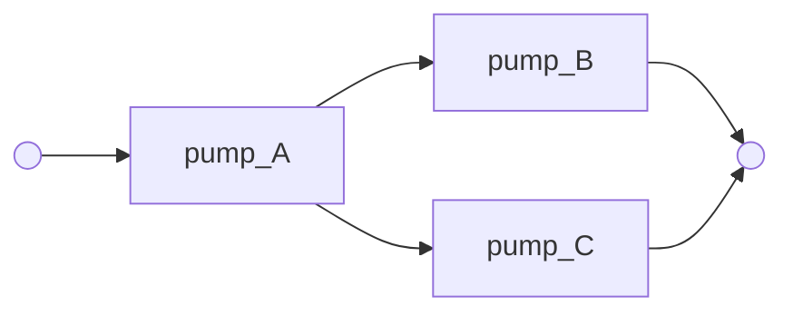

# Importance measures: which failure mode, which component carries the risk

A safety study rarely stops at the probability of the feared event. The
next question is always the same one, and it is the one that turns a
study into a decision: **which component contributes most, and where does
investment pay**. RAICHU answers it natively, from a single Monte-Carlo
campaign, with the classical measures: **Birnbaum**, **Fussell-Vesely**,
**criticality**, and the two pivotal risk levels that risk-achievement and
risk-reduction worth are built from.

The support is the same recording as [sequence
analysis](sequence-analysis.md). Replayed up to the first feared event,
each trajectory gives the failures active when it occurred, a cut; merged
and reduced, the cuts are the minimal cut sets, hence the structure
function of the system. Left to run to the horizon, the same trajectories
replay the state of every failure mode at any instant. Having both, the
measures are computed **by their definitions** rather than by the
rare-event sum a fault-tree tool falls back on, and at three levels:
every **failure mode**, every **component**, and every **group** the
study declares.

## An example: one pump in series, two in parallel

The station loses its supply if `pump_A` fails, or if **both** `pump_B`
and `pump_C` do: two minimal cuts of different sizes, the smallest
diagram where the answer is not obvious.



```python
import pyraichu

RATES = {"pump_A": 0.02, "pump_B": 0.05, "pump_C": 0.08}

model = pyraichu.load_model({
    "name": "pumping_station",
    "plugins": {"muscadet": {"objects": [
        {"type": "ObjFM", "name": f"fm_{block}", "targets": [block],
         "failure": [{"law": "exp", "rate": rate}], "repair": None,
         "failure_effects": {"flow": False}}
        for block, rate in RATES.items()
    ] + [
        {"type": "ObjEvent", "name": "no_supply", "target": True,
         "cond": [
             [{"obj": "pump_A", "attr": "flow", "ope": "==", "value": False}],
             [{"obj": "pump_B", "attr": "flow", "ope": "==", "value": False},
              {"obj": "pump_C", "attr": "flow", "ope": "==", "value": False}],
         ]},
    ]}},
    "components": [
        {"name": block, "attributes": [
            {"name": "flow", "kind": "bool", "init": {"kind": "bool", "value": True}}]}
        for block in RATES
    ],
    "indicators": [],
})

analysis = pyraichu.importance(
    model, nb_runs=20000, t_max=40.0, instants=[10.0, 40.0], seed=42
)

print(f"P(no_supply at t=40) = {analysis.q_cuts[-1]:.3f}")
for cut in analysis.cuts:
    print(f"  cut {' + '.join(cut.events):32s} weight {cut.weight:6.0f}")
for name, c in analysis.components.items():
    print(f"{name:12s} q={c.unavailability[-1]:.3f} "
          f"Birnbaum={c.birnbaum[-1]:.3f} FV={c.fussell_vesely[-1]:.3f} "
          f"crit={c.criticality[-1]:.3f}")
```

```text
P(no_supply at t=40) = 0.924
  cut fm_pump_B.fm.occ + fm_pump_C.fm.occ weight  11916
  cut fm_pump_A.fm.occ                 weight   6570
fm_pump_B    q=0.867 Birnbaum=0.432 FV=0.901 crit=0.405
fm_pump_C    q=0.960 Birnbaum=0.389 FV=0.901 crit=0.404
fm_pump_A    q=0.550 Birnbaum=0.167 FV=0.595 crit=0.100
```

A basic event is named `component.automaton.state`. Components come back
**ranked**, most important first, so `list(analysis.components)` reads as
the answer to the question that was asked. The reported component is the
object that owns the failure automaton: with the default `internal`
behaviour of a muscadet mode, the `ObjFM` itself; with the `external`
behaviour, the physical component the mode is grafted on (next section).

Note what the ranking says here, and that no amount of staring at the
diagram would have said it: the single point of failure `pump_A` is
**not** where to invest. Its cut is a singleton, so it looks like the
obvious weak point, but at this horizon the redundant pair is so degraded
that 90 % of the losses of supply pass through it.

## Failure modes, components and groups

A component often carries several failure modes. In the `external`
behaviour each mode is an automaton grafted on the component, named after
the mode, and every one of them reaches a state named `occ`: the automaton
in the name is what keeps them apart. The analysis then reports each mode
on its own, the component as the unit that gathers its modes, and any
**group** the study declares:

```python
def down(obj, attr="flow"):
    return {"obj": obj, "attr": attr, "ope": "==", "value": False}

def mode(name, target, rate, attribute="flow"):
    return {"type": "ObjFM", "name": name, "behaviour": "external",
            "targets": [target], "failure": [{"law": "exp", "rate": rate}],
            "repair": None, "failure_effects": {attribute: False}}

station = pyraichu.load_model({
    "name": "two_modes",
    "plugins": {"muscadet": {"objects": [
        # Two failure modes of pump_A, each grafted on the pump.
        mode("seal_leak", "pump_A", 0.01, "sealed"),
        mode("bearing", "pump_A", 0.015, "turning"),
        mode("wear_B", "pump_B", 0.05),
        mode("wear_C", "pump_C", 0.08),
        {"type": "ObjEvent", "name": "no_supply", "target": True,
         "cond": [[down("pump_A", "sealed")], [down("pump_A", "turning")],
                  [down("pump_B"), down("pump_C")]]},
    ]}},
    "components": [
        {"name": "pump_A", "attributes": [
            {"name": a, "kind": "bool", "init": {"kind": "bool", "value": True}}
            for a in ("sealed", "turning")]},
    ] + [
        {"name": p, "attributes": [
            {"name": "flow", "kind": "bool", "init": {"kind": "bool", "value": True}}]}
        for p in ("pump_B", "pump_C")
    ],
    "indicators": [],
})

modes = pyraichu.importance(
    station, nb_runs=20000, t_max=40.0, instants=[10.0], seed=42,
    groups={"redundant_pair": ["pump_B.wear_B.occ", "pump_C.wear_C.occ"]},
)
for name, m in modes.basic_events.items():
    print(f"mode      {name:24s} Birnbaum={m.birnbaum[0]:.3f} FV={m.fussell_vesely[0]:.3f}")
for name, c in modes.components.items():
    print(f"component {name:24s} Birnbaum={c.birnbaum[0]:.3f} FV={c.fussell_vesely[0]:.3f}")
for name, g in modes.groups.items():
    print(f"group     {name:24s} Birnbaum={g.birnbaum[0]:.3f} FV={g.fussell_vesely[0]:.3f}")
```

```text
mode      pump_B.wear_B.occ        Birnbaum=0.430 FV=0.553
mode      pump_C.wear_C.occ        Birnbaum=0.306 FV=0.553
mode      pump_A.bearing.occ       Birnbaum=0.711 FV=0.353
mode      pump_A.seal_leak.occ     Birnbaum=0.677 FV=0.243
component pump_A                   Birnbaum=0.785 FV=0.566
component pump_B                   Birnbaum=0.430 FV=0.553
component pump_C                   Birnbaum=0.306 FV=0.553
group     redundant_pair           Birnbaum=0.780 FV=0.553
```

The component level is **computed**, not summed: the Birnbaum of `pump_A`
(0.785, the probability that the pair holds) is not the sum of its two
modes (1.388, which is not even a probability), and neither is its
criticality. Fussell-Vesely does not add up either, since both modes can
be realized at once. A group is measured the same way, `E_g` taking the
place of a component's events: it is how a study gathers modes carried by
other objects (the `internal` behaviour) under the physical component
they affect, or measures a subsystem. A basic event may sit in several
groups.

A **common cause** in the `external` behaviour grafts its automaton on
each of its targets, so its occurrence is one basic event per target and
counts for each of them: every target lists it among its events.

### Which states are basic events

`basic_events` says which recorded states count as failures:

| value | basic events |
|---|---|
| `"failures"` (default) | the states the model's failure transitions enter (`"kind": "failure"`) |
| `"monitored"` | every recorded state other than its automaton's initial one |
| a list of `component.automaton.state` names | exactly those |

The default is what keeps an **intermediate observer** out of the cuts:
an `ObjEvent` that is not the feared event records its entry like every
observer, but it is not a failure, and counting it as one would let it
stand in for the components it watches. A muscadet model declares the
failure roles by itself; a hand-written model that declares none passes
`basic_events="monitored"`, and an analysis that finds no basic event is
refused rather than returned empty.

**On-demand failures** (an `inst` law: a diesel that fails to start when
solicited) are basic events like any other. A draw records its won branch
only (`monitored_states`, see the [model schema](../reference/model-schema.md#transition)):
a lost draw parks the mode until the solicitation falls and is not an
event, so a mode solicited several times and lost before it is won still
reads as failed when the feared event occurs.

## Reading the four numbers

They answer different questions, and a decision usually needs two of them.

| Measure | Question it answers |
|---|---|
| `unavailability` `q_i(t)` | how often is this component down |
| `birnbaum` | how much does the risk move per unit of this component's unavailability: the **sensitivity**, and it does not depend on how likely the component is to fail |
| `fussell_vesely` | what **share** of the risk passes through a cut containing this component |
| `criticality` | the probability that this component is down *and* critical, given the system is down: Birnbaum re-weighted by `q_i` |

Birnbaum is the one to read when asking "how much would a better component
buy"; Fussell-Vesely is the one to read when asking "where does the risk
go today". They disagree exactly when a component is very sensitive but
rarely down, or the reverse: `fm_pump_A` above has the *lowest* Birnbaum
and a middling share, because its partner cut is realized so often that
its own failure changes little.

The two **pivotal risk levels** are reported as levels rather than as
ratios, because both denominators legitimately reach zero:

```python
component = analysis.components["fm_pump_A"]
component.q_system_failed   # the risk with this component certainly failed
component.q_system_intact   # the risk with this component made perfect
component.risk_achievement(analysis)  # Q⁺/Q, risk-achievement worth
component.risk_reduction(analysis)    # Q/Q⁻, risk-reduction worth
```

## What is actually computed

Write `D` for the set of basic events (failure states) active at an
instant, `E_i` for those of unit `i` (a mode, a component, a group), and
`Φ` for the structure function reconstructed from the minimal cuts,
`Φ(D) = 1` iff some cut `K ⊆ D`. Then

- **Birnbaum** is the *pivotal* difference
  `I^B_i = E[Φ(D ∪ E_i) − Φ(D \ E_i)]`: the probability that the system is
  **critical** for the component, failing if it fails and holding if it
  holds. Written this way it assumes nothing about independence between
  components, which matters, because a model with common-cause failures
  violates independence by construction and the textbook
  `∂Q/∂q_i` reading would then be wrong.
- **Fussell-Vesely** is
  `FV_i = P(some realized cut meets E_i | system down)`,
  evaluated on the empirical joint state and not on a rare-event sum of
  cut probabilities. The measures do **not** sum to one, and must not: two
  cuts can be realized at once.
- **Criticality** is `I^B_i · q_i / Q`.

## The completeness diagnostic

The cut structure is empirical: a path no replica walked is not in it, and
a component that only fails through such a path would read as
unimportant. The analysis reports the gap rather than leaving it to be
guessed at:

```python
analysis.q_target   # the feared event as the trajectories recorded it
analysis.q_cuts     # the same instants judged by the reconstructed structure
```

They agree when the corpus is complete. A `q_cuts` below `q_target` means
some way of reaching the feared event was never sampled: raise `nb_runs`
before reading the ranking.

## What it costs

One campaign, plus a reduction linear in the replicas. The trajectories
are reduced as they are produced: what the campaign holds is a few words
per state change of an automaton that carries a basic event or the
feared event, never the trajectories themselves. On the project's
hybrid benchmark (room-temperature ODE, watched thermostats, stochastic
failures) the measures cost **the campaign and nothing measurable on top**:
1.04 s against 1.04 s for a bare Monte-Carlo run of the same size. On a
purely discrete model, where a trajectory is almost free and the
post-processing is as visible as it will ever be, 32 000 replicas of a
16-component plant reduce in 0.39 s, and the growth is linear: 4 000,
8 000, 16 000 and 32 000 replicas take 0.047 s, 0.099 s, 0.198 s and
0.39 s.

## Limits worth knowing

- A component or a group is **failed** when any of its basic events is
  active, and the pivotal `Φ(D ∪ E_i)` sets all of them at once: the
  component-level Birnbaum answers "what if this component fails, however
  it fails".
- Only the modes and components that appear in some minimal cut are
  reported. One that never contributed within the horizon has no
  importance, which is the honest answer, but it also means the list is
  not the model's component list. A declared group is always reported.
- The state of an automaton is the last state its recorded transitions
  entered, so a failure state must be left through a recorded transition.
  The muscadet plugin does the annotation; a hand-written model marks
  `"monitored": true` on the transitions into and out of each failure
  state, and declares `"kind": "failure"` on the failure ones (or passes
  `basic_events="monitored"`).
- The basic events take the automaton from the trajectories the engine
  records. A `raichu.sequences` corpus carries it (its `automata` field),
  except one written before 0.83.0, which names none.

## References

- Birnbaum, Z. W. (1968). *On the importance of different components in a
  multicomponent system*. Technical report.
  DOI [10.21236/ad0670563](https://doi.org/10.21236/ad0670563).
- Fussell, J. B. (1975). How to hand-calculate system reliability and
  safety characteristics. *IEEE Transactions on Reliability* R-24(3),
  169-174. DOI [10.1109/tr.1975.5215142](https://doi.org/10.1109/tr.1975.5215142).
