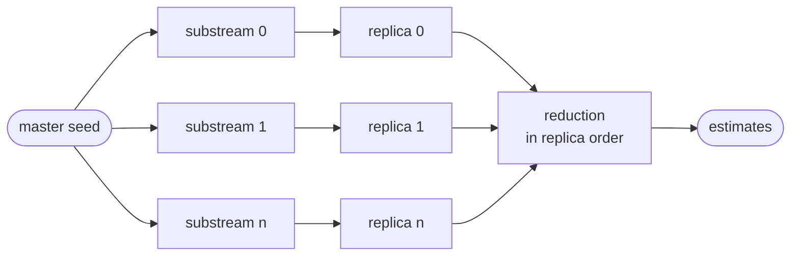

# Parallelism

A Monte-Carlo campaign is *embarrassingly parallel*: the replicas are
independent. RAICHU runs them across a thread pool and gives you the
speed-up for free, while guaranteeing the result does not depend on how
many threads ran it.

## The model



The replicas run on any thread, in any order; what they draw and the order
they are summed in do not depend on it.

- Replicas are distributed over a work-stealing thread pool; the
  **single-trajectory engine stays single-threaded and deterministic**,
  so each replica is itself reproducible (see
  [Reproducibility](reproducibility.md)).
- Replica *r* draws from RNG substream *r*, so replicas never share
  random numbers regardless of scheduling.
- The per-replica results are **reduced serially, in replica-index
  order**. Floating-point addition is not associative, so this ordered
  reduction is what makes the estimate **byte-identical** for any thread
  count: not merely statistically equal.
- The replicas run in **chunks** of 65 536, each folded into the
  running sums as soon as it completes, in replica order. A campaign
  therefore holds one chunk of samples at a time, and its memory does not
  grow with the number of replicas: 10^8 replicas cost what 10^5 do.
  Quantiles are the exception: a nearest-rank quantile needs the whole
  column, so asking for one keeps one value per replica, indicator and
  instant. A probability of reaching a target is a count, and
  `quantify(..., method="monte_carlo")` keeps only the count.

```python
import pyraichu

model = pyraichu.load_model({
    "name": "unit",
    "components": [{"name": "C", "automata": [{
        "name": "a", "states": ["up", "down"], "init": "up",
        "transitions": [
            {"name": "fail", "source": "up", "targets": ["down"],
             "distrib": "exp", "rate": 0.02},
            {"name": "repair", "source": "down", "targets": ["up"],
             "distrib": "exp", "rate": 0.1}]}]}],
    "indicators": [{"name": "down", "target": "state",
                    "component": "C", "automaton": "a", "state": "down"}],
})

samples = [10.0 * k for k in range(11)]
one = pyraichu.monte_carlo(model, nb_runs=20000, t_max=100.0,
                           samples=samples, seed=42, threads=1)
many = pyraichu.monte_carlo(model, nb_runs=20000, t_max=100.0,
                            samples=samples, seed=42, threads=None)

assert one.indicators["down"].mean == many.indicators["down"].mean
print("1 thread and N threads agree to the byte")
```

## Controlling it

- `threads=None` (default) uses the whole machine.
- `threads=1` forces a serial run: useful for profiling the engine
  itself, or in a context that already parallelises at a higher level.
- `threads=k` caps the pool at *k*.

Because the answer is identical whatever you choose, `threads` is purely
a performance dial: develop and debug at `threads=1` for simple stack
traces, then let it default for production throughput. There is nothing
to reconcile afterwards: the numbers are the same.

## Scope

Parallelism uses shared memory on one machine and scales Monte-Carlo to
its local cores. Distributed campaigns are shelved. The API provides no
replica-range partitioning or result-merging operation across machines.
