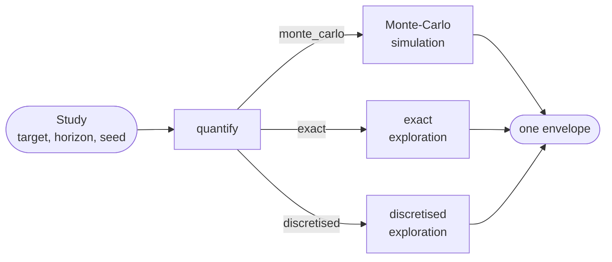

# Quantifying a study: one question, three engines

RAICHU answers "what is the probability that this feared event happens by
this horizon" with three engines: **Monte-Carlo simulation**, **exact
exploration** and **discretised exploration**. `pyraichu.quantify` is the
one entry point to the three: the question is stated once, as a
`pyraichu.Study`, and each engine answers it in the same envelope, so
switching engine means changing one argument.

This guide runs one study through the three engines and reads what comes
back. The envelope's fields are specified in the
[quantification envelope format](../reference/quantification-format.md);
each engine has its own guide for what it does beyond this common
question (see [Further reading](#further-reading)).



## Choosing an engine

| Method | Engine | Covers | States |
|---|---|---|---|
| `"monte_carlo"` | Monte-Carlo simulation | every model | an estimate with a confidence interval |
| `"exact"` | exact exploration | the Markov family (instantaneous branchings, zero delays, exponential laws whose rate is constant between jumps, no continuous evolution) | guaranteed lower and upper bounds, closed-form probabilities |
| `"discretised"` | discretised exploration | every law and continuous evolution | bounds on the discretised model, and an estimate of the discretisation error |

Exploration pays off when the feared event is rare, since it enumerates
paths instead of waiting for replicas to reach them. Monte-Carlo
simulation is the tool for large models, long horizons with repairs, and
anything whose exploration tree grows faster than its cut-offs can bound.

## An example: a unit in series with a redundant pair

Three components fail at constant rates: `A` (0.01 per hour) in series
with a pair `B` (0.1) and `C` (0.2). The system is lost when `A` fails,
or when `B` and `C` have both failed. Over 10 hours the probability of
loss has a closed form, `1 - (1 - pA) (1 - pB pC)` with
`p = 1 - exp(-rate x 10)` for each unit, which the three engines are
checked against below.

```python
import math

import pyraichu


def unit(name, rate):
    return {
        "name": name,
        "automata": [{
            "name": "fail", "states": ["ok", "nok"], "init": "ok",
            "transitions": [{"name": "occ", "source": "ok", "targets": ["nok"],
                             "distrib": "exp", "rate": rate, "monitored": True}],
        }],
    }


def nok(name):
    return {"op": "state_active",
            "state": {"component": name, "automaton": "fail", "state": "nok"}}


def both(*args):
    return {"op": "bool", "bool_op": "and", "args": list(args)}


def either(*args):
    return {"op": "bool", "bool_op": "or", "args": list(args)}


model = pyraichu.load_model({
    "name": "series_pair",
    "components": [
        unit("A", 0.01),
        unit("B", 0.1),
        unit("C", 0.2),
        {
            "name": "sys",
            "automata": [{
                "name": "watch", "states": ["ok", "lost"], "init": "ok",
                "transitions": [{
                    "name": "loss", "source": "ok", "targets": ["lost"],
                    "distrib": "inst", "probs": [],
                    "guard": either(nok("A"), both(nok("B"), nok("C"))),
                }],
            }],
        },
    ],
    "targets": [{"name": "system_lost", "component": "sys",
                 "automaton": "watch", "state": "lost"}],
})

horizon = 10.0
p = {name: 1 - math.exp(-rate * horizon)
     for name, rate in (("A", 0.01), ("B", 0.1), ("C", 0.2))}
closed_form = 1 - (1 - p["A"]) * (1 - p["B"] * p["C"])
```

The study names the target, the horizon and, for Monte-Carlo, the seed.
The same object goes to every engine:

```python
study = pyraichu.Study("system_lost", horizon, seed=7)

mc = pyraichu.quantify(model, study, method="monte_carlo", nb_runs=20_000)
exact = pyraichu.quantify(model, study, method="exact")
disc = pyraichu.quantify(model, study, method="discretised", level=4)
```

The settings after `method` belong to that method alone: `nb_runs` to
Monte-Carlo simulation, `level` to discretised exploration. A setting
given to the wrong method is refused before anything runs, naming the
methods that do take it:

```python
try:
    pyraichu.quantify(model, study, method="exact", nb_runs=1000)
except pyraichu.SimulationError as error:
    print(error)
```

## Reading the probability

`result.probability` is the probability that the study's target is the
first declared target reached by the horizon. Its `kind` says which
uncertainty the engine can state, and `[low, high]` is that uncertainty:
a confidence interval for Monte-Carlo simulation, guaranteed bounds for
exact exploration, bounds on the discretised model for discretised
exploration.

For Monte-Carlo simulation the kind is `"confidence_interval"`: the
estimate is the proportion of replicas that reached the target, with a
Wilson interval at the declared level (0.95 unless `confidence` says
otherwise).

```python
prob = mc.probability
assert prob.kind == "confidence_interval"
print(f"{prob.reached} of {prob.replicas} replicas: {prob.estimate:.4f} "
      f"in [{prob.low:.4f}, {prob.high:.4f}] at {prob.level:.0%}")
assert prob.low <= closed_form <= prob.high
```

For the explorations the kind is `"bounds"`: `low` is the sum of the
probabilities of the sequences kept, `high` adds the mass the cut-offs
discarded, and `inconclusive` flags a gap wider than the declared
tolerance. With no cut-off declared, exact exploration closes the gap on
this model and returns the closed form:

```python
prob = exact.probability
assert prob.kind == "bounds" and not prob.inconclusive
assert math.isclose(prob.low, closed_form, rel_tol=1e-9)
assert math.isclose(prob.high, closed_form, rel_tol=1e-9)
```

Discretised exploration bounds the probability of the **discretised**
model, and reports how far that model may sit from the real one as
`error_estimate`, an estimate obtained by refining the discretisation,
not a bound:

```python
prob = disc.probability
print(f"[{prob.low:.6f}, {prob.high:.6f}], error estimate {prob.error_estimate:.1e}")
assert abs(prob.low - closed_form) <= prob.error_estimate
```

The four answers side by side, each with the uncertainty it states (the
discretised bounds widened by the error estimate), against the closed form:

{ .figure }
{ .figure }

*Figure produced by `docs/figures/guide_quantification_engines.py`.*

## Provenance and detail

The rest of the envelope says where the answer comes from. `method` and
`settings` record what ran, defaults resolved; `engine_version`, `model`
and `model_hash` identify the engine and the model; `seed` and `instants`
are recorded for Monte-Carlo simulation only, since the explorations do
not use them.

```python
print(exact.method, exact.settings["rel_precision"])
print(exact.engine_version, exact.model, exact.model_hash)
assert mc.seed == 7 and exact.seed is None
assert exact.model_hash == mc.model_hash == disc.model_hash
```

`result.detail` is the engine's own result, unchanged: the Monte-Carlo
estimates (`pyraichu.McEstimates`) of the one campaign behind the
proportion, or the exploration (`pyraichu.Exploration`) with its
sequences. The sequences of an exploration say how the system gets lost,
each with its probability:

```python
assert mc.detail.nb_runs == 20_000
for seq in exact.detail.sequences[:3]:
    path = " -> ".join(event["obj"] for event in seq.events)
    print(f"{seq.probability:.4e}  {path}")
```

## Saving and reading back

`to_json` writes the envelope as the engine produced it, and
`pyraichu.read_quantification` reads it back into an equal object, so a
result can be archived and compared later:

```python
exact.to_json("exact.json")
assert pyraichu.read_quantification("exact.json") == exact
```

The model hash is comparable between envelopes of the same engine
version only: see [the content hash](../reference/quantification-format.md#provenance).

## Further reading

- [Quantification envelope format](../reference/quantification-format.md):
  every field of the envelope, and what a reader refuses.
- [Confidence intervals](confidence-intervals.md): the Monte-Carlo
  intervals and their methods.
- [Sequence-tree exploration](sequence-tree-exploration.md): the cut-offs,
  the exact domain, discretised exploration and its cost.
- [Stochastic & Monte-Carlo](../tutorial/03-stochastic-and-monte-carlo.md):
  Monte-Carlo campaigns with indicators beyond the feared event.
