# Quantifying a study: one question, five engines

RAICHU answers "what is the probability that this feared event happens by
this horizon" with five engines: **Monte-Carlo simulation**, **exact
exploration**, **discretised exploration**, **cross-entropy** (a biased
Monte-Carlo campaign for rare events) and **adaptive splitting**. `pyraichu.quantify` is the one
entry point to the five: the question is stated once, as a
`pyraichu.Study`, and each engine answers it in the same envelope, so
switching engine means changing one argument.

This guide runs one study through the first three engines, then a rare
event through cross-entropy and splitting, and reads what comes back. The envelope's fields are specified in the
[quantification envelope format](../reference/quantification-format.md);
each engine has its own guide for what it does beyond this common
question (see [Further reading](#further-reading)).

```mermaid
flowchart LR
    ST(["Study<br/>target, horizon, seed"]) --> Q["quantify"]
    Q -->|monte_carlo| MC["Monte-Carlo<br/>simulation"]
    Q -->|exact| EX["exact<br/>exploration"]
    Q -->|discretised| DI["discretised<br/>exploration"]
    Q -->|cross_entropy| CE["cross-entropy<br/>biased sampling"]
    MC --> ENV(["one envelope"])
    EX --> ENV
    DI --> ENV
    CE --> ENV
    Q -->|splitting| SP["adaptive splitting"]
    SP --> ENV
```



## Choosing an engine

| Method | Engine | Covers | States |
|---|---|---|---|
| `"monte_carlo"` | Monte-Carlo simulation | every model | an estimate with a confidence interval |
| `"exact"` | exact exploration | the Markov family (instantaneous branchings, zero delays, exponential laws whose rate is constant between jumps, no continuous evolution) | guaranteed lower and upper bounds, closed-form probabilities |
| `"discretised"` | discretised exploration | every law and continuous evolution | bounds on the discretised model, and an estimate of the discretisation error |
| `"cross_entropy"` | biased Monte-Carlo, factors fitted by cross-entropy | every model; biases constant-rate exponential laws only, the rest runs unbiased | a weighted estimate with a confidence interval and its diagnostics |
| `"splitting"` | adaptive multilevel splitting | native models with a numeric importance attribute or a coherent fault tree, all laws; no imported FMUs | a mean over independent batches, a Student interval and extinction diagnostics |

Exploration pays off when the feared event is rare, since it enumerates
paths instead of waiting for replicas to reach them. Monte-Carlo
simulation is the tool for large models, long horizons with repairs, and
anything whose exploration tree grows faster than its cut-offs can bound.
When the event is too rare for a plain campaign and the model too large to
explore, cross-entropy keeps the simulation and makes the event frequent
(see [Rare feared events](#rare-feared-events-cross-entropy)).

## An example: a unit in series with a redundant pair

Three components fail at constant rates: `A` (0.01 per hour) in series
with a pair `B` (0.1) and `C` (0.2). The system is lost when `A` fails,
or when `B` and `C` have both failed. Over 10 hours the probability of
loss has a closed form, `1 - (1 - pA) (1 - pB pC)` with
`p = 1 - exp(-rate x 10)` for each unit, which the three engines are
checked against below.

```python
import math

import pyraichu


def unit(name, rate):
    return {
        "name": name,
        "automata": [{
            "name": "fail", "states": ["ok", "nok"], "init": "ok",
            "transitions": [{"name": "occ", "source": "ok", "targets": ["nok"],
                             "distrib": "exp", "rate": rate, "monitored": True}],
        }],
    }


def nok(name):
    return {"op": "state_active",
            "state": {"component": name, "automaton": "fail", "state": "nok"}}


def both(*args):
    return {"op": "bool", "bool_op": "and", "args": list(args)}


def either(*args):
    return {"op": "bool", "bool_op": "or", "args": list(args)}


model = pyraichu.load_model({
    "name": "series_pair",
    "components": [
        unit("A", 0.01),
        unit("B", 0.1),
        unit("C", 0.2),
        {
            "name": "sys",
            "automata": [{
                "name": "watch", "states": ["ok", "lost"], "init": "ok",
                "transitions": [{
                    "name": "loss", "source": "ok", "targets": ["lost"],
                    "distrib": "inst", "probs": [],
                    "guard": either(nok("A"), both(nok("B"), nok("C"))),
                }],
            }],
        },
    ],
    "targets": [{"name": "system_lost", "component": "sys",
                 "automaton": "watch", "state": "lost"}],
})

horizon = 10.0
p = {name: 1 - math.exp(-rate * horizon)
     for name, rate in (("A", 0.01), ("B", 0.1), ("C", 0.2))}
closed_form = 1 - (1 - p["A"]) * (1 - p["B"] * p["C"])
```

The study names the target, the horizon and, for Monte-Carlo, the seed.
The same object goes to every engine:

```python
study = pyraichu.Study("system_lost", horizon, seed=7)

mc = pyraichu.quantify(model, study, method="monte_carlo", nb_runs=20_000)
exact = pyraichu.quantify(model, study, method="exact")
disc = pyraichu.quantify(model, study, method="discretised", level=4)
```

The settings after `method` belong to that method alone: `nb_runs` to
Monte-Carlo simulation, `level` to discretised exploration. A setting
given to the wrong method is refused before anything runs, naming the
methods that do take it:

```python
try:
    pyraichu.quantify(model, study, method="exact", nb_runs=1000)
except pyraichu.SimulationError as error:
    print(error)
```

## Reading the probability

`result.probability` is the probability that the study's target is the
first declared target reached by the horizon. Its `kind` says which
uncertainty the engine can state, and `[low, high]` is that uncertainty:
a confidence interval for Monte-Carlo simulation, guaranteed bounds for
exact exploration, bounds on the discretised model for discretised
exploration.

For Monte-Carlo simulation the kind is `"confidence_interval"`: the
estimate is the proportion of replicas that reached the target, with a
Wilson interval at the declared level (0.95 unless `confidence` says
otherwise).

```python
prob = mc.probability
assert prob.kind == "confidence_interval"
print(f"{prob.reached} of {prob.replicas} replicas: {prob.estimate:.4f} "
      f"in [{prob.low:.4f}, {prob.high:.4f}] at {prob.level:.0%}")
assert prob.low <= closed_form <= prob.high
```

For the explorations the kind is `"bounds"`: `low` is the sum of the
probabilities of the sequences kept, `high` adds the mass the cut-offs
discarded, and `inconclusive` flags a gap wider than the declared
tolerance. With no cut-off declared, exact exploration closes the gap on
this model and returns the closed form:

```python
prob = exact.probability
assert prob.kind == "bounds" and not prob.inconclusive
assert math.isclose(prob.low, closed_form, rel_tol=1e-9)
assert math.isclose(prob.high, closed_form, rel_tol=1e-9)
```

Discretised exploration bounds the probability of the **discretised**
model, and reports how far that model may sit from the real one as
`error_estimate`, an estimate obtained by refining the discretisation,
not a bound:

```python
prob = disc.probability
print(f"[{prob.low:.6f}, {prob.high:.6f}], error estimate {prob.error_estimate:.1e}")
assert abs(prob.low - closed_form) <= prob.error_estimate
```

The four answers side by side, each with the uncertainty it states (the
discretised bounds widened by the error estimate), against the closed form:

{ .figure }
{ .figure }

*Figure produced by `docs/figures/guide_quantification_engines.py`.*

## Rare feared events: cross-entropy

A plain campaign needs about `100 / p` replicas to estimate a probability
`p` to 10 %: a million for `p = 1e-4`, ten billion for `p = 1e-8`. The
`cross_entropy` method draws the dates of constant-rate exponential
transitions at multiplied rates, so the feared event is reached often, and
weights each replica by its likelihood ratio, so the weighted proportion
is still an unbiased estimate of `p`. Textbooks call the technique
importance sampling; the factors are fitted by the cross-entropy method
(de Boer, Kroese, Mannor and Rubinstein, 2005) over a few pilot campaigns
before the final one.

Take a redundant pair, `D` and `E`, each failing at 1e-4 per hour: losing
both within 10 hours has a probability of about 1e-6.

```python
rare = pyraichu.load_model({
    "name": "rare_pair",
    "components": [
        unit("D", 1e-4),
        unit("E", 1e-4),
        {
            "name": "sys",
            "automata": [{
                "name": "watch", "states": ["ok", "lost"], "init": "ok",
                "transitions": [{
                    "name": "loss", "source": "ok", "targets": ["lost"],
                    "distrib": "inst", "probs": [],
                    "guard": both(nok("D"), nok("E")),
                }],
            }],
        },
    ],
    "targets": [{"name": "pair_lost", "component": "sys",
                 "automaton": "watch", "state": "lost"}],
})
rare_form = (1 - math.exp(-1e-4 * horizon)) ** 2

ce = pyraichu.quantify(rare, pyraichu.Study("pair_lost", horizon, seed=7),
                       method="cross_entropy", nb_runs=4000, pilot_runs=500)
p = ce.probability
print(f"{p.estimate:.3e} +/- {p.standard_error:.1e}, closed form {rare_form:.3e}")
print(f"effective sample size {p.effective_sample_size:.0f}, "
      f"relative error {p.relative_error:.1%}")
assert not p.inconclusive
assert abs(p.estimate - rare_form) <= 4 * p.standard_error
```

The detail names each family of transitions that shares a factor, and the
factor the final campaign used. Here `D` and `E` are the same kind of
unit at the same rate, so they form one family:

```python
for family in ce.detail.families:
    print(family.label, family.transitions, round(family.factor))
```

Read the verdict and the diagnostics before the interval:

- **`inconclusive`**: true when the effective sample size is below the
  method's threshold (`min_effective_sample_size`, default 50). The
  estimate and its interval are then not to be trusted, however narrow the
  interval: read it as "not established", not as a number.
- **effective sample size**: how many equally weighted hits the estimate
  is worth. Near 1, a single replica carries the estimate.
- **relative error**: the standard error over the estimate. It measures
  the precision reached only when the estimate is conclusive: with a few
  dominant weights, the standard error is itself badly estimated.
- A campaign that never reaches the target raises `SimulationError`
  instead of returning a zero: a zero would read as "impossible" where the
  campaign only saw nothing.

The fit is declared converged only from a pilot whose own effective sample
size reaches the same threshold: a pilot whose few hits are carried by one
replica returns that replica's rates, so its factors barely move whatever
the truth, and it cannot confirm anything.

**One regime is out of reach of this version.** A highly reliable system
with fast repairs over a long horizon reaches the feared event through
many failure and repair cycles, and one fixed factor per family cannot
bias such trajectories well. Measured on redundant pairs of this kind, the
estimate came from 30 % to three orders of magnitude below the truth, with
an interval that did not contain it, and an effective sample size between
1 and 35: such results are marked `inconclusive`. The same pair over a
short horizon, or with slow repairs over a long one, is recovered within
its interval with an effective sample size of 48 and more.

Only constant-rate exponential laws are biased in this version. Other laws
(Weibull, delays, on-demand failures, state-dependent rates) run at their
nominal law, which keeps the estimate unbiased but brings no variance
reduction through them. Repairs start unbiased; a family can be merged or
named by hand with `families={"comp.automaton.transition": "label"}`.

## Rare feared events: splitting

Choose splitting when progress towards the feared event passes through
intermediate states that a numeric attribute can rank. Cross-entropy instead
changes constant exponential rates; it can help a rare single jump where
splitting has no intermediate state to clone. Neither method establishes
an estimate merely because its returned interval looks narrow. Fast repair
cycles may defeat both methods; inspect `inconclusive`.

Splitting observes the attribute after each complete instant, including all
simultaneous transitions and propagation, plus optional `score_grid` dates
for a continuously evolving score. It replaces every particle tied at the
lowest running maximum and restarts at a survivor's first strictly higher
score. The target always ranks above every finite score.

This pair illustrates a graded score, the number of failed units. Its
probability at one hour is `(1 - exp(-0.1))**2`. The smaller explicit budget
keeps this example quick; omitted budgets use the driver's calibrated
defaults, recorded in `result.settings`.

```python
def number(value):
    return {"op": "const", "value": {"kind": "float", "value": value}}


split_pair = pyraichu.load_model({
    "name": "graded_pair",
    "components": [unit("E", 0.1), unit("F", 0.1), {
        "name": "sys",
        "attributes": [{"name": "score", "kind": "float",
                        "init": {"kind": "float", "value": 0.0}}],
        "equations": [{"target": "score", "kind": "explicit", "expr": {
            "op": "add", "args": [
                {"op": "if", "cond": nok(name), "then": number(1.0),
                 "otherwise": number(0.0)} for name in ("E", "F")
            ]}}],
        "automata": [{"name": "watch", "states": ["ok", "lost"], "init": "ok",
            "transitions": [{"name": "loss", "source": "ok", "targets": ["lost"],
                "distrib": "inst", "probs": [], "guard": both(nok("E"), nok("F"))}]}],
    }],
    "targets": [{"name": "lost", "component": "sys", "automaton": "watch", "state": "lost"}],
})
split = pyraichu.quantify(
    split_pair, pyraichu.Study("lost", 1.0, seed=7), method="splitting",
    importance={"kind": "attribute", "name": "sys.score"},
    particles=200, batches=20, confidence=0.99,
)
truth = (1 - math.exp(-0.1)) ** 2
p = split.probability
print(p.estimate, p.low, p.high, truth)
assert p.kind == "splitting_estimate" and p.low <= truth <= p.high
assert not p.inconclusive
assert len(split.detail.batches) == 20
assert pyraichu.read_quantification(split.to_json()) == split
```

The `importance` setting decides what ranks the intermediate states. A
declared attribute (`{"kind": "attribute", "name": "sys.score"}`) is the
choice when the model already carries a natural score, or when its logic
is not monotone in the states. The automatic source (`{"kind":
"cut_sets"}`) needs no designed score: it generates the target's fault
tree once, keeps its minimal cut sets, and scores each completed instant
with the largest share of one cut set's basic events currently realised,
a heuristic inspired by the minimal-cut-set committor approximations of
Chennetier et al. (2024), rather than their exact formula or an optimal
committor. It refuses, quoting the reason, when fault-tree generation
refuses the model (a state read under a negation, a guard it cannot
explain): declare an attribute then. `max_cut_sets` (default 1000) caps
how many cut sets are kept, since every completed instant scores them
all; the cap applies to the final minimal family after absorption, and a
target with more is refused naming the cap.

```python
auto = pyraichu.quantify(
    split_pair, pyraichu.Study("lost", 1.0, seed=7), method="splitting",
    importance={"kind": "cut_sets"}, particles=200, batches=20, confidence=0.99,
)
print(auto.settings["importance"])
assert auto.probability.low <= truth <= auto.probability.high
```

The mean includes every independent batch, including extinct batches as
zero. The interval uses Student's distribution across batch estimates;
particles within one batch are related and are not independent observations.
Any extinct batch, nonpositive lower bound or relative half-width above one
marks the result `inconclusive`. The detail exposes each batch's estimate,
level history, killed counts and trajectory count. Reaching `max_iterations`
raises `SimulationError` without returning an estimate.

Restarts draw fresh stochastic futures conditional on elapsed age for every
native law, including Weibull and state-dependent hazards. A `resume` clock
keeps its frozen age and is redrawn when rearmed. Deterministic and watched
dates remain fixed. Imported FMUs are refused because their snapshots cannot
provide this restart contract. A constant score provides no useful graded
progress and may go extinct; a numeric score alone does not ensure precision.

## Provenance and detail

The rest of the envelope says where the answer comes from. `method` and
`settings` record what ran, defaults resolved; `engine_version`, `model`
and `model_hash` identify the engine and the model; `seed` and `instants`
are recorded for the methods that use them: both for Monte-Carlo
simulation, the seed alone for cross-entropy and splitting, neither for the
explorations.

```python
print(exact.method, exact.settings["rel_precision"])
print(exact.engine_version, exact.model, exact.model_hash)
assert mc.seed == 7 and exact.seed is None
assert exact.model_hash == mc.model_hash == disc.model_hash
```

`result.detail` is the engine's own result, unchanged: the Monte-Carlo
estimates (`pyraichu.McEstimates`) of the one campaign behind the
proportion, or the exploration (`pyraichu.Exploration`) with its
sequences. The sequences of an exploration say how the system gets lost,
each with its probability:

```python
assert mc.detail.nb_runs == 20_000
for seq in exact.detail.sequences[:3]:
    path = " -> ".join(event["obj"] for event in seq.events)
    print(f"{seq.probability:.4e}  {path}")
```

## Saving and reading back

`to_json` writes the envelope as the engine produced it, and
`pyraichu.read_quantification` reads it back into an equal object, so a
result can be archived and compared later:

```python
exact.to_json("exact.json")
assert pyraichu.read_quantification("exact.json") == exact
```

The model hash is comparable between envelopes of the same engine
version only: see [the content hash](../reference/quantification-format.md#provenance).

## Further reading

- [Quantification envelope format](../reference/quantification-format.md):
  every field of the envelope, and what a reader refuses.
- [Confidence intervals](confidence-intervals.md): the Monte-Carlo
  intervals and their methods.
- [Sequence-tree exploration](sequence-tree-exploration.md): the cut-offs,
  the exact domain, discretised exploration and its cost.
- [Stochastic & Monte-Carlo](../tutorial/03-stochastic-and-monte-carlo.md):
  Monte-Carlo campaigns with indicators beyond the feared event.
