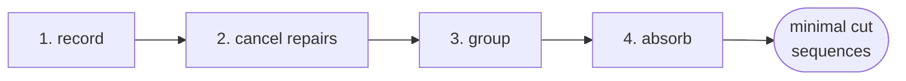

# Sequence analysis: feared events & minimal cut sequences

Safety studies do not only ask *how often* an undesired event occurs:
they ask **which chains of failures lead to it**. RAICHU answers both
natively: declare a **feared event** as a *target*, run a Monte-Carlo
campaign where every trajectory records its causal event sequence and
stops at the first occurrence, then reduce the corpus to **minimal cut
sequences**: the irreducible, ordered failure combinations that reach
the event, weighted by how many trajectories they explain.

## Declaring a feared event

The simplest way is an `ObjEvent` plugin object flagged `"target": true`:
its `occ` state becomes the trajectory-stopping target and the label of
every recorded sequence.

```json
{
  "type": "ObjEvent", "name": "system_down", "target": true,
  "cond": [[
    {"obj": "A", "attr": "flow", "ope": "==", "value": false},
    {"obj": "B", "attr": "flow", "ope": "==", "value": false}
  ]]
}
```

At the native level this is a model-wide `targets` entry: any automaton
state can be one (see the [model schema](../reference/model-schema.md)):

```json
"targets": [{"name": "system_down", "component": "system_down",
             "automaton": "ev", "state": "occ"}]
```

When a target state activates, the engine finishes the current instant
(everything due at the same date still fires), records the **end cause**,
and stops the trajectory: the *first-occurrence* semantics of safety
campaigns.

A study written in muscadet says the same thing by naming the event on the
**run** rather than on the model: `system.simulate(params, engine="raichu",
targets=["EVT_LOSS"])`, and `pyraichu.muscadet.engine.build_model(spec,
targets=[...])` for the model this page's `analyse_sequences` takes. One
system is run twice, free-cycling for its availability figures and
first-occurrence for its sequences, which is why a target is a parameter of
the run there. See the [muscadet engine guide](muscadet-engine.md).

## From trajectories to minimal cut sequences

`pyraichu.analyse_sequences` runs the campaign and the whole reduction
pipeline:

```python
import pyraichu

model = pyraichu.load_model({
    "name": "redundant_pair",
    "plugins": {"muscadet": {"objects": [
        # One failure mode with common-cause orders over two targets:
        # order 1 = independent failures, order 2 = both at once.
        {"type": "ObjFM", "name": "fm", "targets": ["A", "B"],
         "failure": [{"law": "exp", "rate": 0.1}, {"law": "exp", "rate": 0.03}],
         "repair":  [{"law": "exp", "rate": 0.5}, {"law": "exp", "rate": 0.5}],
         "failure_effects": {"flow": False}},
        {"type": "ObjEvent", "name": "system_down", "target": True,
         "cond": [[{"obj": "A", "attr": "flow", "ope": "==", "value": False},
                   {"obj": "B", "attr": "flow", "ope": "==", "value": False}]]},
    ]}},
    "components": [
        {"name": n,
         "attributes": [{"name": "flow", "kind": "bool",
                         "init": {"kind": "bool", "value": True}}]}
        for n in ("A", "B")
    ],
    "indicators": [{"name": "system_down_occ", "target": "state",
                    "component": "system_down", "automaton": "ev",
                    "state": "occ"}],
})

cuts = pyraichu.analyse_sequences(model, nb_runs=2000, t_max=100.0, seed=42)
for cut in cuts:
    if cut["end_cause"] == "system_down":
        chain = " → ".join(f"{e['obj']}.{e['attr']}" for e in cut["events"])
        print(f"{cut['weight']:5.0f}  {chain}")
```

```text
 1075  fm.occ__cc_1_2 → system_down.occ
  478  fm.occ__cc_2 → fm.occ__cc_1 → system_down.occ
  441  fm.occ__cc_1 → fm.occ__cc_2 → system_down.occ
```

Three minimal cut sequences: the **common-cause** direct path dominates,
and the two **order-dependent** sequential paths (A-then-B vs B-then-A)
are reported separately: sequences are ordered, unlike classic cut
*sets*. Weights are trajectory counts: divide by `nb_runs` for
probabilities. The result is seed-reproducible bit-for-bit.

The pipeline behind the call:



1. **Record**: each trajectory logs its *monitored* transitions (the
   plugin marks failure/repair and event transitions automatically) and
   stops at the first target.
2. **Cancel transient cycles**: a failure that was repaired *before*
   the feared event did not cause it: paired failure/repair events of
   the same mode are removed (per component, so distinct modes never
   cancel each other).
3. **Group**: trajectories left with the same ordered event signature
   merge; weights add up and dates are averaged.
4. **Minimal absorption**: a sequence that contains a shorter reaching
   sequence is absorbed into it; only irreducible cuts remain.

Steps 2 and 3 run on each trajectory as the campaign produces it, and the
trajectory is then dropped: a campaign holds one chunk of trajectories in
flight plus one entry per distinct cleaned path, so its memory does not grow
with `nb_runs`. Cancelling before grouping is what makes that hold on a
repairable system, where nearly every raw trajectory is distinct (its
transient cycles differ) while the paths left once they are cancelled are
few. Up to 0.81.0 every trajectory was held until the end of the campaign,
which ran out of memory at 1e7 trajectories on a 39-component repairable
model.

Two results can differ from 0.81.0, which also grouped once before
cancelling. Averaged dates may differ in their last bits. And when a longer
sequence contains two minimal ones of the same length and weight, 0.81.0
absorbed it into whichever its grouping order put first; it now goes to the
one with the smaller event signature, so the minimal level depends only on
the cleaned paths and their weights, never on the order they were reduced
in.

## Keeping the raw corpus

`analyse_sequences` returns the minimal sequences and discards what they were
reduced from. `run_sequences` runs the same campaign (the same seed gives the
same trajectories) and keeps it: the two reduced levels come back, and every
trajectory's raw sequence is written to `raw_path` in the
[`raichu.sequences` format](../reference/sequence-format.md), straight from the
engine.

```python
campaign = pyraichu.run_sequences(model, nb_runs=2000, t_max=100.0, seed=42,
                                  raw_path="campaign.jsonl")
campaign.minimal   # what analyse_sequences returns
campaign.cleaned   # every distinct path, transient cycles removed

again = pyraichu.analyse_raw_sequences("campaign.jsonl")
assert again.minimal == campaign.minimal
```

The raw corpus holds one line per trajectory, dates included, so it is the
level to audit a campaign on, to filter, or to hand to another tool. It is
written line by line as the campaign runs, and `analyse_raw_sequences` reads
it line by line: neither holds the trajectories, so the file is the only
thing that grows with `nb_runs` (about 1.6 kB per trajectory on a two-component
repairable model over 200 time units).

### Observing a value, and reducing under a condition

A campaign can also read chosen attributes at chosen instants on every
trajectory, and reduce only the trajectories whose reading satisfies a
condition. An `Observation(name, component, attribute, time)` records the
value; a `SequenceCondition(observation, op, value)` keeps a trajectory when
that value compares to `value` as `op` says (`==`, `!=`, `<`, `<=`, `>`,
`>=`). A boolean reads `0` or `1`:

```python
# The paths to the feared event among trajectories where A still delivered at t = 50.
conditioned = pyraichu.run_sequences(
    model, nb_runs=2000, t_max=100.0, seed=42, raw_path="conditioned.jsonl",
    observations=[pyraichu.Observation("A_at_50", "A", "flow", 50.0)],
    condition=pyraichu.SequenceCondition("A_at_50", "==", 1.0),
)
report = conditioned.condition
assert report["kept_trajectories"] <= report["total_trajectories"] == 2000

# The corpus keeps every trajectory, so it answers another condition later.
other = pyraichu.analyse_raw_sequences(
    "conditioned.jsonl", condition=pyraichu.SequenceCondition("A_at_50", "==", 0.0))
assert (other.condition["kept_trajectories"] + report["kept_trajectories"]
        == report["total_trajectories"])
```

Observing changes no trajectory: the same seed gives the same corpus,
observations added. The exact reading rules (a trajectory stopped earlier, an
instant past the horizon) are in the
[corpus format reference](../reference/sequence-format.md#observations).

## First-occurrence indicators

The Monte-Carlo estimator has the matching measures. By default
`monte_carlo` lets trajectories run and cycle freely: an
*availability* view. With `stop_at_targets=True` it applies the same
early-stop as the sequence analysis and **latches** the state: once the
feared event occurs, it stays occurred through every later sampling
instant: a *reliability / first-occurrence* view.

```python
est = pyraichu.monte_carlo(model, nb_runs=2000, t_max=100.0,
                           samples=[50.0, 100.0], seed=42,
                           stop_at_targets=True)
ind = est.indicators["system_down_occ"]
ind.nb_occurrences_mean   # P(occurred by t): at most one per trajectory
ind.sojourn_mean          # mean time elapsed since the first occurrence
```

`nb_occurrences_mean` / `nb_occurrences_std` (the number of state
entries up to each instant) are also estimated in the free-cycling mode,
where an event can occur repeatedly.

!!! note "Which mode to compare with what"
    When cross-checking against another tool, match the semantics:
    campaigns recorded **with** targets measure first-occurrence
    quantities (latched sojourn ≈ horizon − first hit), campaigns
    **without** measure cumulated exposure. The two differ by orders of
    magnitude on repairable systems.

## From cut sequences to importance measures

The minimal cut sequences are also the support of the **importance
measures**: which component contributes most to the feared event, and
where investment pays. Dropped to sets they are the minimal cut sets,
hence the structure function of the system, and the same campaign replays
the state of every failure mode at any instant. See [importance
measures](importance-measures.md).

```python
analysis = pyraichu.importance(model, nb_runs=2000, t_max=100.0,
                               instants=[50.0, 100.0], seed=42)
for name, component in analysis.components.items():
    print(name, component.birnbaum[-1], component.fussell_vesely[-1])
```

## Native model, without plugins

Sequence recording works on hand-written models too: set
`"monitored": true` on the transitions you want in the sequences, group
failure/repair pairs with a shared `"cycle_group"`, and declare
`targets`. The plugin layer simply does this annotation for you.
