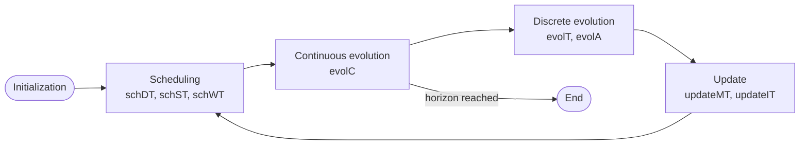

# Model schema reference

A RAICHU model is a JSON object (or an equivalent Python `dict`) passed
to `pyraichu.load_model`. This page documents every field, distribution and
expression operator. Types are the JSON types; a *ref* is a small object
that names something elsewhere in the model.

A complete, minimal model that uses most sections:

<!-- model -->
```json
{
  "name": "example",
  "components": [
    {
      "name": "C",
      "attributes": [
        {"name": "load", "kind": "float", "init": {"kind": "float", "value": 1.0}}
      ],
      "ports": [{"name": "out", "dir": "out", "attr": "load"}],
      "automata": [
        {
          "name": "health", "states": ["ok", "ko"], "init": "ok",
          "transitions": [
            {"name": "fail", "source": "ok", "targets": ["ko"],
             "distrib": "exp", "rate": 0.01}
          ]
        }
      ]
    }
  ],
  "connections": [],
  "indicators": [
    {"name": "C_ko", "target": "state",
     "component": "C", "automaton": "health", "state": "ko"}
  ]
}
```

## Model

| key | type | required | meaning |
|---|---|---|---|
| `name` | string | yes | model name (carried into provenance) |
| `components` | array of [Component](#component) | yes | the system's parts |
| `connections` | array of [Connection](#connection) | no (default `[]`) | out-port → in-port wiring |
| `interface_connections` | array of [Interface connection](#interface-connection) | no (default `[]`) | interface ↔ interface wiring, expanded into port connections; requires the `interface_connections` feature |
| `indicators` | array of [Indicator](#indicator) | no (default `[]`) | what the engine measures |
| `targets` | array of [Target](#target) | no (default `[]`) | feared-event states for [sequence analysis](../guides/sequence-analysis.md) |
| `programs` | array of [Program](#program) | no (default `[]`) | discrete mixed-integer optimisation steps |
| `evaluation_order` | array of VarRef | no (default: declaration order) | sweep order of the explicit equations, see [Evaluation order](#evaluation-order) |
| `unbounded_rate` | number | no (default: none reserved) | the magnitude that stands for "no ceiling", which no integrated rate may reach, see [Unbounded rate](#unbounded-rate) |
| `fmu_units` | array of [FMU unit](#fmu-unit) | no (default `[]`) | imported FMI co-simulation units; requires the `fmi` feature |

### FMU unit

An FMU unit connects an FMI 2.0 or 3.0 co-simulation archive to model
attributes. Its declaration does not grant permission to execute native
code. The runner must grant FMU import explicitly; this first version
loads the FMU's native library in the engine process, without isolation.

| key | type | meaning |
|---|---|---|
| `name` | string | unit name, unique within the model |
| `path` | string | `.fmu` archive path; relative paths resolve against the loader's explicit base directory, defaulting to the document directory for a file or the working directory for an in-memory document |
| `step` | positive finite number | communication interval in model time units |
| `inputs` | array of bindings | model attributes sampled into FMU inputs; a tunable FMU parameter may also be bound here |
| `outputs` | array of bindings | FMU outputs copied into model attributes at communication points |
| `parameters` | array of start values | FMU parameter values assigned during initialization |

A binding is `{"attribute": {"component": string, "attribute": string},
"variable": string}`. A start value is `{"variable": string, "value":
Value}`. Structural validation checks that each bound model attribute
exists, each output attribute and output variable is bound at most once,
no output attribute has another writer (equation, sensitive function or
transition effect), and `step` is finite and positive. Preparation checks
the FMU description for variable names, causality and compatible types
before loading its binary. The FMU's content hash identifies it in run
provenance; the path is only a locator.

<!-- model -->
```json
{
  "raichu_model": {"format": 1, "requires": ["fmi"]},
  "model": {
    "name": "pump_with_external_physics",
    "components": [{
      "name": "pump",
      "attributes": [
        {"name": "command", "kind": "float", "init": {"kind": "float", "value": 0.0}},
        {"name": "flow", "kind": "float", "init": {"kind": "float", "value": 0.0}}
      ]
    }],
    "fmu_units": [{
      "name": "hydraulics",
      "path": "units/hydraulics.fmu",
      "step": 0.1,
      "inputs": [{"attribute": {"component": "pump", "attribute": "command"},
                  "variable": "command"}],
      "outputs": [{"variable": "flow",
                   "attribute": {"component": "pump", "attribute": "flow"}}],
      "parameters": [{"variable": "gain",
                      "value": {"kind": "float", "value": 2.0}}]
    }]
  }
}
```

The `fmi` entry is derived from the nonempty `fmu_units` list when the
model is sealed. A bare document with a unit, or an envelope that omits
`fmi`, is refused before model preparation. No unit means the field is
omitted on serialization and the required feature list is unchanged.

### Program

A program is solved at the initial discrete fixpoint and whenever an input
attribute or automaton state changes. It may dispatch decisions across
components. A document containing a nonempty `programs` list must use the
format envelope and declare `mixed_integer_program` under `requires`.

| key | type | meaning |
|---|---|---|
| `name` | string | unique program name |
| `variables` | array of variable objects | decisions in default tie-break order |
| `sense` | `minimize` or `maximize` | direction of the primary objective |
| `objective` | Expr | affine primary objective |
| `constraints` | array of constraint objects | ranged linear constraints |
| `feasible` | AttrRef | Bool attribute set to true for an optimum, false when infeasible |
| `objective_value` | AttrRef | optional Float attribute set to the optimum, or 0 when infeasible |
| `tie_break` | `none` or `{ "objectives": [...] }` | optional secondary objectives; omitted uses lexicographic minimisation of decisions |
| `node_limit` | positive integer | optional deterministic branch-and-bound cap, default 100,000 |

Each variable is `{ "attribute": AttrRef, "lower": Expr?, "upper": Expr?,
"on_infeasible": Value }`. The attribute's kind selects continuous (`float`),
integer (`int`) or binary (`bool`) decision. A binary decision has implicit
bounds 0 and 1. Every variable needs a fallback of the same kind.

Each constraint is `{ "name": string, "expr": Expr, "lower": Expr?,
"upper": Expr? }`, with at least one bound. Its meaning is
`lower <= expr <= upper`. A secondary objective is `{ "sense":
"minimize"|"maximize", "expr": Expr }`. After the primary and declared
secondary optima are fixed, the solver minimises each decision in
declaration order unless `tie_break` is `none`.
Each preceding optimum is retained within `1e-9 * max(1, abs(optimum))`
when the next objective is solved. Continuous decisions can therefore differ
from a closed-form optimum by that numerical tolerance. Integer decisions
outside the exact `f64` range (absolute value above `2^53`) fail the run.

The objective and constraint expressions must be affine in the decision
attributes. Coefficients and bounds can read discrete attributes and states,
including outputs of sensitive functions, transition effects and earlier
programs. A program cannot read one of its own outputs, use `time`, or read
an ODE target, an explicit-equation target or an allocated channel, including
through `port_agg`. Program dependencies cannot form a cycle. No other
writer may assign one of a program's decision or output attributes.

An infeasible solve publishes every variable's fallback and `feasible=false`.
An unbounded program, node-limit stop or solver fault ends the trajectory
with an error naming the program and date. See the
[optimisation guide](../guides/optimisation.md) for a runnable dispatch.

### Connection

`{ "from": PortRef, "to": PortRef, "name": string }` where a **PortRef**
is `{ "component": string, "port": string }`. `from` must name an
out-port, `to` an in-port.

`name` is optional and names the **edge**, nothing else: it only feeds
the naming of the per-connection attributes materialised for the source
port's [channels](#port). Absent, the edge is named after its
destination, which is unambiguous unless two connections join the same
pair of ports; naming at least one of those is then required, and the
model is refused otherwise.

### Interface connection

`{ "from": InterfaceRef, "to": InterfaceRef, "name": string }` where an
**InterfaceRef** is `{ "component": string, "interface": string }`.
It joins two [interfaces](#interface) at once and stands for one
[connection](#connection) per port, **paired by port name**: an out port
on either side is connected to the in port of the same name on the
other side, so one interface connection can carry flows in both
directions, as a message box does.

```json
{"from": {"component": "Pump", "interface": "hydraulic"},
 "to":   {"component": "Valve", "interface": "hydraulic"}}
```

With `Pump.hydraulic = [flow, pressure]` (an out port `flow`, an in port
`pressure`) and `Valve.hydraulic = [pressure, flow]` (an out port
`pressure`, an in port `flow`), it expands to `Pump.flow → Valve.flow`
and `Valve.pressure → Pump.pressure`.

The pairing must be exact, and the model is refused otherwise:

- every port of each interface has a partner of the same name on the
  other side;
- the two partners have opposite directions.

The engine runs on the expansion: the explicit `connections` first, in
declaration order, then each interface connection in declaration order,
its ports in the order the `from` interface lists them. Validation,
compilation and the pre-run diagnostics all read that one list. The
document keeps the interface connection as written: it is not rewritten
into port connections when it is loaded or saved. `name`, optional, is
given to every port connection the interface connection expands to.

## Component

Only `name` is required; every collection defaults to empty.

| key | type | meaning |
|---|---|---|
| `name` | string | component name (unique in the model) |
| `attributes` | array of [Attribute](#attribute) | intrinsic typed state |
| `ports` | array of [Port](#port) | connection points |
| `interfaces` | array of [Interface](#interface) | named groups of ports |
| `automata` | array of [Automaton](#automaton) | state machines |
| `sensitive_functions` | array of [SensitiveFunction](#sensitivefunction) | declarative effects |
| `equations` | array of [Equation](#equation) | continuous dynamics |
| `allocations` | array of [Allocation](#allocation) | conservative distribution operators |

### Attribute

`{ "name": string, "kind": "bool"|"int"|"float", "init": Value }`.
A **Value** is `{ "kind": "bool"|"int"|"float", "value": <literal> }`.

### Port

| key | type | meaning |
|---|---|---|
| `name` | string | port name (unique in the component) |
| `dir` | `"in"` \| `"out"` | direction |
| `attr` | string | **out-ports only**: the attribute this port exports |
| `channels` | array of [Channel](#channel) | **out-ports only**, optional (default `[]`): per-connection quantities |

An in-port omits `attr`; it aggregates whatever is connected to it (read
with the [`port_agg`](#expressions) operator).

### Channel

`{ "name": string, "init": float }` (`init` optional, default `0`),
declared on an **out** port. An in port never declares channels: it reads
them, and a channel list on an in port is refused.

An out port exports **one** attribute, so every in port connected to it
reads the same number. A channel is the opposite affordance: one quantity
**per connection**, so a producer can hand a different share to each
consumer over the same port (a conservative flow).

The channel is declared once, here; the **compiler materialises** one
float attribute per (connection, channel) on the producing component,
named

```
<out port>__<channel>__<edge>
```

where `<edge>` is the connection's `name` when it has one and
`<destination component>__<destination port>` otherwise. So a channel
`share` on port `out`, over an unnamed connection to `consumer.input`,
materialises `out__share__consumer__input` on the producing component.

Those attributes are **ordinary float attributes**: equations and
sensitive functions write them, indicators observe them, the causal
journal records them under that name, and the snapshot carries them. They
are not declared in `attributes`, and a declared attribute that collides
with a materialised name is refused at build time, naming both.

A consumer reads a channel through `port_agg` with a `channel` selector
(see [Expressions](#expressions)). Without a selector, `port_agg` keeps
reading the exported `attr`: the producer's total stays visible.

### Interface

`{ "name": string, "ports": [string, …] }`: a named bundle of the
component's ports, which must exist on the component. An
[interface connection](#interface-connection) joins two of them at once.

### Automaton

`{ "name": string, "states": [string, …], "init": string,
"transitions": [Transition, …] }`. State names are scoped **to the
automaton**. `init` must be one of `states`.

### Transition

| key | type | meaning |
|---|---|---|
| `name` | string | transition name |
| `source` | string | source state (in the same automaton) |
| `targets` | array of string | destination state(s) |
| `guard` | [Expr](#expressions) | optional; must hold for the transition to be eligible |
| `on_interruption` | `"reset"` \| `"resume"` \| `"continue"` | optional (default `reset`); see [below](#interruption-policy) |
| `monitored` | bool | optional (default `false`); firing is recorded in the trajectory's [sequence](../guides/sequence-analysis.md) |
| `cycle_group` | string | optional; failure/repair partners share it so transient cycles cancel in the sequence pipeline (paired per component) |
| `monitored_states` | array of string | optional (default: every target); the targets whose entry a `monitored` transition records, a non-empty subset of `targets`. A draw `rep → [occ, not_occ]` records `["occ"]`: a lost draw only parks the automaton and is not an event. Requires the feature `monitored_states` |
| `kind` | `"failure"` \| `"repair"` | optional (default absent); the declared reliability role, see [Declared kind](#declared-kind) |
| `effects` | array of Assignment | optional; written ONCE when the transition fires, see [Edge effects](#edge-effects) |
| `distrib` + params | - | the occurrence distribution, flattened onto the transition (see [Distributions](#distributions)) |

#### Edge effects

`effects` lists assignments (`{"target": VarRef, "value": Expr}`, the
shape a sensitive function's effects take) that the transition makes
**once**, when it fires, after its state change and before anything
propagates, in declaration order. A sensitive function's effects are a
level, re-evaluated whenever what they read changes; an edge effect is
never re-applied and nothing restores what it wrote, so the attribute
keeps the value until something else writes it. That is a one-shot
effect, and on an attribute nothing else writes, a variable that
memorises: a detection latched by a failure and cleared by its repair.
An interrupted transition writes nothing.

An edge effect on an attribute an explicit equation or a sensitive
function also writes is refused: the next evaluation would erase it.

On the target of an **ODE** equation, an edge effect is a **reset map**,
the jump of a piecewise-deterministic Markov process (Davis): the
continuous state takes the written value at the firing instant and the
integration of the next segment starts from it. Watched guards and
state-dependent hazards that read the variable see the new value from
that instant. A tank refilled at once when a pump is repaired, a counter
of accumulated wear reset by a maintenance, a bouncing ball whose
velocity flips at the floor: each is one transition writing its ODE
target. The written value must be a finite float; any other value stops
the run with an error naming the transition. A value sampled at the very
instant of the jump reads the state before it.

A document carrying the field declares the `transition_effects` feature.

#### Declared kind

`kind` declares what firing the transition means: `"failure"`
(something fails), `"repair"` (something returns to service) or
`"observation"` (the transition belongs to an observer, see below).
Absent, the transition has no declared role, which is the
reading of every model written before the field existed. Any other value
is refused at load, naming it.

The role applies to the transition's **first declared target** only. An
on-demand failure draw is one instantaneous transition with two targets,
`["occ", "parked"]`: firing into `occ` is the failure, while a lost draw
entering `parked` is neither a failure nor a repair. Declare the failure
state first.

The kind changes no simulated trajectory. Its reader is the
failure-count cut-off of a sequence-tree exploration, which counts the
fired `failure` transitions along a sequence and refuses a model that
declares none rather than silently counting nothing. Roles are declared
rather than inferred from state names, a convention the engine could not
check.

The muscadet plugin declares them on the failure-mode edges it emits:

- an internal `ObjFM` (and `ObjFMInst`) declares its occurrence edge,
  or its on-demand draw, `failure`, and its return edge, or its on-demand
  return draw, `repair`, for every common-cause combination; a re-arm out
  of a parked state declares nothing;
- an external `ObjFM` declares the kinds on each target's mirror
  automaton, where its sequence events live, and leaves its own automaton
  undeclared, so one occurrence counts once per target and never twice.

Feared events (`ObjEvent`) declare their two edges `observation`.

**`observation` changes the firing order, and nothing else.** Transitions
due at the same date fire in **waves**: a transition armed before a wave
fires before the transitions that wave arms, which is how the reference
engine orders them (two failures due at one date both fire before the feared
event they cause). Within one wave an `observation` transition fires first,
then any other in positional order. An observer writes nothing the rest of
the model reads, so firing it first changes no converged state; what it
changes is what the observer sees: a state the model reaches and leaves
within one instant (an alarm raised then cleared by a zero-delay repair) is
observed and counted, as the reference counts it. Unlike the two
reliability roles, it therefore requires the feature `observer_priority`.

### Target

`{ "name": string, "component": string, "automaton": string, "state":
string }`: a **feared event**: when the named state activates, a
sequence-recording trajectory records `name` as its end cause and stops
(after completing the current instant, every transition still due at it
included, so the state held through the remaining sample instants is the
instant's converged state). Ignored unless sequence recording /
`stop_at_targets` is enabled.

## Distributions

A transition has one of **two natures**, distinguished by where its
randomness lives:

- **Timed**: the firing *date* is drawn (or fixed) and the transition
  has a single effective destination. It is either **deterministic**
  (`delay`) or **stochastic** (`exp`, `weibull`, `gamma`, `lognormal`,
  `uniform`, `empirical`).
- **Instantaneous**: the transition fires at the instant its guard
  holds; the randomness is in the **choice of destination** among its
  targets (`inst`, with `probs`).

Both natures are encoded through the `distrib` key, with the distribution's parameters
on the same transition object.

### Timed distributions (the firing date)

| `distrib` | parameters | notes |
|---|---|---|
| `delay` | `time`: number | fixed deterministic duration |
| `exp` | `rate`: number **or** `rate_expr`: [Expr](#expressions) | exponential; `rate_expr` is a state-dependent rate |
| `weibull` | `shape`, `scale`: number | |
| `lognormal` | `mu`, `sigma`: number | |
| `gamma` | `shape`, `scale`: number | |
| `uniform` | `low`, `high`: number | |
| `empirical` | `points`: array of `[t, F(t)]` | measured CDF (time, cumulative probability) |

### Instantaneous distribution (the destination branch)

| `distrib` | parameters | notes |
|---|---|---|
| `inst` | `probs`: array of number | fires when the guard holds; `probs` are the destination probabilities, `len(probs) = len(targets) − 1` (the complement is reconstructed) |

### `watched`: a guard on continuous attributes

`"distrib": "watched"` is **not a third nature**. It marks a *guarded*
transition whose guard involves continuously-evolving (ODE-driven)
attributes: the engine must **monitor the continuous trajectory** and
fire the transition exactly when the boundary is crossed (located by
root-finding), rather than re-checking the guard only at discrete events.

It is declared explicitly because that intent **cannot be inferred from
the guard alone**: the same comparison could instead gate a timed
transition's eligibility. A watched transition takes no distribution parameters
and requires a `guard` containing an ordering comparison
(`lt`/`le`/`gt`/`ge`).

### Interruption policy

`on_interruption` governs a running countdown whose guard becomes false:

| value | behaviour |
|---|---|
| `reset` (default) | the elapsed countdown is cancelled and redrawn when the guard holds again |
| `resume` | the countdown pauses and resumes where it left off |
| `continue` | the countdown never stops, guard or not |

## SensitiveFunction

`{ "name": string, "effects": [Assignment, …] }`. An **Assignment** is
`{ "target": VarRef, "value": Expr }`, where **VarRef** is
`{ "component": string, "attribute": string }`. The engine derives *when*
to run a sensitive function from the attributes and states its
expressions read: there is no manual trigger list, and no callback runs
during numerical integration.

## Equation

`{ "target": string, "kind": "ode"|"explicit", "expr": Expr }`. The
`target` is a local `float` attribute; `ode` means `d(target)/dt = expr`,
`explicit` means `target = expr`.

### Linear algebraic cycles

A cycle of explicit equations that is affine in its own target attributes
is solved simultaneously as one block of the sweep, including during ODE
right-hand-side evaluation. For example, `v = 10 - i` and `i = v` give
`v = i = 5`; a breaker changing an outside coefficient automatically
changes the next solution. No solve call or new equation kind is needed.

`sum` and `mean` over connected numeric ports are affine, and `count` is
constant. Products of two unknowns, unknown-dependent denominators,
`min`, `max`, comparisons and conditions reading a block unknown are
refused, naming the offending term. `if` conditions over outside inputs
or automaton states are accepted; only the selected branch is evaluated.
`median`, `all` and `any` over block unknowns are refused.

The solved matrix is `I - A` for `x = A*x + b`. Structural singularity
uses a conservative sparsity pattern: literal zeros are absent, including
an identity diagonal cancelled by a literal coefficient one. Computed
cancellations are handled by LU. Constant rank-deficient systems are
refused at compilation; state-dependent singularities raise a typed error
with the variables and simulation date. An ODE target or allocated channel
still cuts the algebraic dependency graph.

Only a model containing a block is reordered, by stable topological order
of the condensed dependency graph. Independent steps retain declaration
order. A declared `evaluation_order` lists each original step once;
block members become simultaneous, and a reader-before-producer conflict
is refused. Allocated channels impose no ordering edge on their readers,
which retain their position where other dependencies allow it. Models
without a block retain their original compiled sweep exactly.

See [numerical tuning](../guides/numerical-tuning.md#algebraic-block-pivots)
for the pivot policy.

## Allocation

The **conservative distribution operator**: it reads one available
quantity and one demand per outgoing connection, and writes one allocated
quantity per outgoing connection, under a declared policy. Nothing to do
with the [occurrence distributions](#distributions) of a transition,
which say *when* something fires.

| key | type | meaning |
|---|---|---|
| `name` | string | operator name, unique in the component; the name that designates this step in the [evaluation order](#evaluation-order) |
| `port` | string | the **out** port whose connections receive the quantity |
| `available` | [Expr](#expressions) | the quantity to distribute (negative distributes nothing) |
| `demand` | string | [channel](#channel) of `port` carrying what each consumer asks for (read) |
| `allocated` | string | channel of `port` receiving what each consumer gets (written) |
| `policy` | `"proportional"` \| `"shares"` \| `"priority"` | how a shortage is split |

A [sensitive function](#sensitivefunction) effect writes **one** target,
so it cannot express a split: the share handed to one consumer depends on
what every other consumer asked for. The operator therefore writes the
whole vector at once, as one step of the explicit sweep, and is evaluated
at every evaluation point like an equation. That placement is what lets a
[watched](#watched-a-guard-on-continuous-attributes) guard reading an
allocated quantity be *located* at its crossing instant rather than
noticed at the next discrete date.

### Policies

| `policy` | parameters | rule |
|---|---|---|
| `proportional` | none | each consumer receives `available x demand / Σ demands`, capped at its own demand |
| `shares` | `shares`: array of ConsumerParam | each receives `available x share`, capped at its own demand |
| `priority` | `priorities`: array of ConsumerParam | consumers are served in full, in ascending rank, until the quantity runs out |

A **ConsumerParam** is `{ "to": PortRef, "value": number }`: the value
that applies to the connection ending at `to`. Keying by destination
rather than by position means inserting or reordering a connection cannot
re-attach a share to a different consumer. A keyed policy must cover every
connection of the port exactly once, and `shares` must sum to 1 over
them; both are refused at build time, naming the component and the flow.

### What the operator guarantees

- **Conservation.** No consumer receives more than it asked for, and the
  quantities handed out never exceed what was available. A consumer that
  asks for less than its share does not absorb the surplus: a capping loop
  fixes it at its demand and redistributes the rest, in at most one pass
  per consumer.
- **Order independence.** Each share is a function of its own demand and
  of the totals, never of a position in the sweep, so equal demands
  receive equal quantities. The two real ties, equal demands under
  `proportional` and equal ranks under `priority`, break by **connection
  declaration index**: a property of the model file, never of the
  engine's evaluation order or of a hash order.
- **One writer.** Nothing else may write an allocated quantity, neither an
  equation nor a sensitive function nor a second operator: refused at
  build time, because two writers mean the last one silently wins.

Negative demands and a negative available quantity are read as zero (a
level crossing zero mid-segment lands a few ulps below it, and that is
rounding, not a negative demand); a non-finite one is an error naming the
operator.

### How a network of operators is resolved

One pass of the sweep is not the answer when what a consumer asks for
depends on what it was given. The engine therefore **resolves** the
network at every discrete epoch (initialization, after a fired
transition) and again at every located active-set crossing, in two
stages:

1. **The active set, settled to exact equality.** Which consumers are
   saturated, and which branch of each minimum and each conditional the
   sweep takes, is a finite combinatorial question. It is settled first,
   because settling it turns most of the problem from asymptotic into
   finite.
2. **The flows, settled to a tolerance.** Once the active set repeats,
   the sweep is iterated until no quantity moves by more than the
   per-edge flow tolerance, `1e-9` relative above unit scale and absolute
   below it.

The iteration **descends**, and it starts from a **cold state** in which
every allocated quantity is zero. Each consumer then sizes itself as
though it held nothing, so the first pass over-estimates every delivery;
the sequence that follows is non-increasing and bounded below. Iterating
up from zero deliveries carries no such argument. The cold state is
recomputed at each resolution rather than carried from the previous one,
so nothing about the search lives outside the attribute vector and a
restored snapshot replays exactly.

A model that declares no operator has no active set to settle and skips
all of this: it runs the same single ordered pass it ran before the
resolution existed.

### The active set inside an integration segment

Only the *search* is done at the boundary. The resolved network is
evaluated by the ordinary explicit pass at **every solver stage**, so a
flow moves with the state and a [watched](#watched-a-guard-on-continuous-attributes)
guard reading one is located at its crossing instant.

The frozen active set is itself watched. Every operator contributes one
**active-set margin** per outgoing connection, monitored exactly like a
watched guard: the segment ends the moment a consumer would become
saturated (or stop being), the network is resolved again from that state,
and integration continues. With `journal` enabled each of those crossings
appears as an `active_set_crossed` record naming the operator, the edge,
and the two saturation classes.

Each margin carries a **dead band** equal to the flow tolerance. Without
it a network resolved *on* a boundary would re-cross it at once and
chatter there; with it, a residual smaller than what the resolution
itself promises is not treated as a crossing. That is why the band is the
flow tolerance and not the (ten times smaller) event-location tolerance.

A **minimum** gets no margin of its own. A limiting reagent written as a
minimum over inputs keeps a kink rather than a jump, which the integrator
handles unaided, and one watched guard per input pair would add a
quadratic population for accuracy the kink already provides. Which branch
a minimum takes still enters the resolution's stopping test, where it is
free.

### `priority` and surplus return: refused together

A consumer **returns surplus** when the demand it publishes on an edge
depends, through the explicit sweep, on the quantity that same operator
allocated it. That shape is legal and useful: it is what lets a consumer
limited elsewhere hand back what it cannot use, within the same
resolution. Allocated quantities are deliberately excluded from
[algebraic block classification](#linear-algebraic-cycles).

Combined with `priority` it is **refused at build time**, naming the
component, the operator, the demand channel and the allocated channel it
reaches. The descending resolution needs the ordered pass to
over-estimate every delivery; nobody has shown that for a strict priority
order, where a consumer whose demand shrinks because it was served can
move the point at which the supply runs out and *raise* a later
consumer's delivery. Rather than promise a resolution and then report it
as non-convergent, the engine refuses the composition. Use `proportional`
or `shares`, whose weighted split keeps the over-estimate, or cut the
dependency.

`priority` on its own, and surplus return on its own, are both accepted.

<!-- model -->
```json
{
  "raichu_model": {"format": 1, "requires": ["allocation"]},
  "model": {
    "name": "shortage",
    "components": [
      {
        "name": "supply",
        "attributes": [
          {"name": "available", "kind": "float", "init": {"kind": "float", "value": 5.0}}
        ],
        "ports": [
          {"name": "out", "dir": "out", "attr": "available",
           "channels": [{"name": "demand"}, {"name": "alloc"}]}
        ],
        "equations": [
          {"target": "out__demand__a", "kind": "explicit",
           "expr": {"op": "const", "value": {"kind": "float", "value": 6.0}}},
          {"target": "out__demand__b", "kind": "explicit",
           "expr": {"op": "const", "value": {"kind": "float", "value": 4.0}}}
        ],
        "allocations": [
          {"name": "split", "port": "out", "demand": "demand", "allocated": "alloc",
           "available": {"op": "attr",
             "attr": {"component": "supply", "attribute": "available"}},
           "policy": "proportional"}
        ]
      },
      {
        "name": "a",
        "attributes": [
          {"name": "got", "kind": "float", "init": {"kind": "float", "value": 0.0}}
        ],
        "ports": [{"name": "input", "dir": "in"}],
        "equations": [
          {"target": "got", "kind": "explicit",
           "expr": {"op": "port_agg", "agg": "sum", "channel": "alloc",
                    "port": {"component": "a", "port": "input"}}}
        ]
      },
      {
        "name": "b",
        "attributes": [
          {"name": "got", "kind": "float", "init": {"kind": "float", "value": 0.0}}
        ],
        "ports": [{"name": "input", "dir": "in"}],
        "equations": [
          {"target": "got", "kind": "explicit",
           "expr": {"op": "port_agg", "agg": "sum", "channel": "alloc",
                    "port": {"component": "b", "port": "input"}}}
        ]
      }
    ],
    "connections": [
      {"name": "a", "from": {"component": "supply", "port": "out"},
       "to": {"component": "a", "port": "input"}},
      {"name": "b", "from": {"component": "supply", "port": "out"},
       "to": {"component": "b", "port": "input"}}
    ]
  }
}
```

Five units against demands of 6 and 4: `a` receives 3 and `b` receives 2.

## Evaluation order

The explicit equations are swept **once** per evaluation point, in a
single pass. An equation that reads an attribute the same pass has not
reached yet therefore reads what the *previous* evaluation point left
there. The order is part of the answer, not an implementation detail.

A **step** of the sweep is either an explicit equation, designated by its
target attribute, or an [allocation](#allocation), designated by its own
name. An operator writes many attributes, so it is named rather than
targeted; a component may not give one name to both, which is refused.

By default the order is **positional**: components in declaration order,
and inside each, the explicit equations in declaration order followed by
the distribution operators. A model without an algebraic block keeps
exactly that order. Blocks use the condensation order described above.

`evaluation_order` overrides it with an explicit list of
`{ "component": string, "attribute": string }`, and must cover the
declared steps **exactly**: one entry each, no omission, no repetition,
and nothing that is neither an explicit equation nor an operator (an ODE
target is carried by the integrator, so it is never listed). A partial
order is refused rather than completed, naming what is missing, unknown
or repeated.

A model carrying the field must be sealed in the
[format envelope](#document-format-and-the-feature-envelope) and declare
the `evaluation_order` feature:

<!-- model -->
```json
{
  "raichu_model": {"format": 1, "requires": ["evaluation_order"]},
  "model": {
    "name": "ordered",
    "components": [
      {
        "name": "C",
        "attributes": [
          {"name": "x", "kind": "float", "init": {"kind": "float", "value": 0.0}},
          {"name": "y", "kind": "float", "init": {"kind": "float", "value": 0.0}}
        ],
        "equations": [
          {"target": "y", "kind": "explicit",
           "expr": {"op": "add", "args": [
             {"op": "attr", "attr": {"component": "C", "attribute": "x"}},
             {"op": "const", "value": {"kind": "float", "value": 1.0}}]}},
          {"target": "x", "kind": "explicit",
           "expr": {"op": "const", "value": {"kind": "float", "value": 5.0}}}
        ]
      }
    ],
    "evaluation_order": [
      {"component": "C", "attribute": "x"},
      {"component": "C", "attribute": "y"}
    ]
  }
}
```

Declared as above, `y` is 6 at every evaluation point. Without the field,
the positional sweep computes `y` before `x` and it is 1 at the first
one.

**A step that reads what a later step writes tears a ring.** An order
cannot always avoid it: a room feeding a ventilation that feeds the room
back has no order in which every read comes after its write. One pass of
such a sweep reads, at the tear, the value the previous evaluation left
there. The flow resolution repeats the pass until it settles, at every
discrete date and every located crossing; inside the integrator, the
right-hand side of a torn sweep does the same, repeating the pass until
no attribute moves by more than the flow tolerance (at most the
resolution's sweep budget), so that it is a function of the state and not
of the stage evaluated before it. A sweep without a tear is evaluated
once, as it always was.

## Unbounded rate

A document has no literal for an infinity, so a model meaning "no
ceiling" (a volume that puts no limit on the rate it is drawn at, a
demand that takes whatever comes) writes a finite stand-in instead. As
the ceiling of a `min` against a finite demand the stand-in is harmless.
As the **rate of a stock** it is not: where an unbounded demand meets an
unbounded supply, the stand-in becomes a derivative, and the integrator
steps the stock far past its bound before any event can be located. A
volume holding 5 read -9.3e19, and the run ended normally.

`unbounded_rate` declares that magnitude. The engine then refuses any ODE
right-hand side whose absolute value reaches it, with an error naming
the integrated variable, the date and the rate, instead of integrating
it. The physics of such a draw is an instantaneous transfer, which a
rate cannot express; the modeller bounds one of the two sides (a finite
fill or serve rate, or a finite demand). From Python the refusal is a
`pyraichu.UnboundedRateError`, a `SimulationError` whose `variable`,
`time`, `rate` and `unbounded` attributes carry the same facts as the
message.

The value must be finite and positive. Absent, nothing is reserved and
nothing is checked. The `pyraichu.muscadet` layer declares `1e30`, the
stand-in it writes, on every model with a continuous network. A document
carrying the field declares the `unbounded_rate` feature:

```json
{
  "raichu_model": {"format": 1, "requires": ["unbounded_rate"]},
  "model": {"name": "drain", "unbounded_rate": 1e30, "components": []}
}
```

## Document format and the feature envelope

A model document comes in one of two shapes.

**Bare body.** The model object itself, as everywhere else on this page.
This is what the whole existing corpus uses, and it stays readable. A
bare body declares no feature, so it may only use **baseline**
constructs: everything the format could express before the feature
registry opened.

**Envelope.** A mandatory header plus the body underneath:

```json
{
  "raichu_model": {"format": 1, "requires": ["evaluation_order"]},
  "model": {"name": "…", "components": []}
}
```

| key | type | meaning |
|---|---|---|
| `format` | integer | revision of the envelope itself (currently `1`) |
| `requires` | array of string | feature names the document requires |

### Why a wrapper rather than a field

The schema accepts unknown fields. An optional `requires` field placed
next to `name` and `components` would therefore be **invisible** to an
engine that predates it: that engine would parse the document, ignore
the field *and the construct it announces*, and return a different
number instead of a refusal. Silence is the failure to avoid.

The envelope instead **displaces** the fields a legacy reader requires:
the body moves under `model`, so a reader expecting `name` and
`components` at the top level fails on a missing field rather than
succeeding on a misread. That refusal works even against engines
released before the envelope existed. Readers from this version on know
the shape, so their refusal is the precise, named one:

- a `requires` entry this engine does not implement → refused, naming
  the feature and listing the implemented ones;
- a body using a non-baseline construct the document does not declare →
  refused, naming the construct.

### The list is derived, not trusted

`requires` is never taken on trust. The reader derives the truth from
the parsed body and refuses a document whose declaration does not cover
it, so a hand-written model cannot use a construct and stay silent about
it. On the writing side the list is composed by the engine:
`pyraichu.required_features(body_json)` returns it and `pyraichu.seal`
wraps a body with it, which is how an authoring layer (and the plugin
expansion, through the model-level key `evaluation_order`) emits a
sealed document without ever writing the list by hand.

The Python helpers, all in `pyraichu`:

| name | does |
|---|---|
| `required_features(body_json)` | the feature list the body needs, derived by the engine |
| `seal(document, extra_features=())` | wraps a dict in the envelope when it needs one, keeping any feature it already declares |
| `seal_model(model_json)` | the same on a JSON string, bare or already enveloped |
| `model_body(document)` | the body of a document in either shape |
| `MODEL_ENVELOPE_KEY` | `"raichu_model"`, the key that marks an envelope |
| `MODEL_FORMAT_REVISION` | the envelope revision this engine writes |

### Feature registry

| feature | construct |
|---|---|
| `evaluation_order` | model-level [evaluation order](#evaluation-order) |
| `allocation` | component-level [allocations](#allocation) |
| `unbounded_rate` | model-level [unbounded rate](#unbounded-rate) |
| `transition_effects` | transition-level [edge effects](#edge-effects) |
| `fmi` | model-level [FMU units](#fmu-unit) |
| `mixed_integer_program` | model-level [programs](#program) |
| `observer_priority` | transition-level [declared kind](#declared-kind) `observation` |
| `interface_connections` | model-level [interface connections](#interface-connection) |
| `monitored_states` | transition-level [recorded targets](#transition) |

The transition-level [declared kind](#declared-kind) `failure` or
`repair` is a **baseline** construct and has no feature name (the kind
`observation` is the exception, `observer_priority`): an engine that ignored it would
simulate exactly the same trajectories, since only the exploration's
failure-count cut-off reads it, and that cut-off refuses a model with no
declared kind instead of counting nothing. A bare body may carry it.

The registry names **serialized constructs**, not engine behaviour, so a
change in how an existing construct is *interpreted* does not add a
feature: it makes the construct that carries it mean something new. The
[network resolution](#how-a-network-of-operators-is-resolved), the
active-set margins and the `priority`/surplus-return refusal all arrive
with `allocations` and are therefore covered by `allocation`. No engine
that implements `allocation` implements it without them: the two landed
in the same release, which is what keeps the one feature name honest.

## Indicator

`{ "name": string, "target": "attribute"|"state"|"predicate", … }`:

- `target: "attribute"` → `"attr": VarRef`
- `target: "state"` → `"component"`, `"automaton"`, `"state"` (strings)
- `target: "predicate"` → `"attr": VarRef`, `"cmp"` (one of `eq`, `ne`,
  `lt`, `le`, `gt`, `ge`), `"value"` (a [Value](#attribute))

Estimators are computed by `monte_carlo`, per schedule instant, on six
measures of the observed value:

| measure | fields | what it is |
|---|---|---|
| value | `mean`, `std`, `ci`, `quantiles`, `extremes` | the value at the instant |
| sojourn | `sojourn_mean`, `sojourn_std`, `sojourn_ci`, `sojourn_quantiles`, `sojourn_extremes` | its cumulated time-integral since `t = 0` |
| occurrences | `nb_occurrences_mean`, `nb_occurrences_std`, `nb_occurrences_ci`, `nb_occurrences_extremes` | how many times it entered the state or condition, up to the instant |
| reached | `reached_mean`, `reached_std`, `reached_ci`, `reached_extremes` | the probability of having been active at least once by the instant; unlike the value, it never comes back down |
| zero departures | `zero_departures_mean`, `zero_departures_std`, `zero_departures_ci`, `zero_departures_extremes` | how many times the value left exactly `0` for any non-zero value, sign ignored, up to the instant; the initial value is never counted |
| non-zero reached | `nonzero_reached_mean`, `nonzero_reached_std`, `nonzero_reached_ci`, `nonzero_reached_extremes` | the probability of having been non-zero at least once by the instant, the initial value included |

The last two pairs read the same change points as occurrences and reached,
with another rule. Occurrences count rising edges (from `<= 0` to `> 0`)
and take an active initial value as the first one; zero departures do not
count the initial value, count a move to a negative value, and ignore a
move between two non-zero values. A value that is only ever negative is
non-zero reached and never reached. On a state, a `predicate` or a `bool`
attribute that starts inactive the two pairs coincide. Zero departures
and non-zero reached are what the reference engine's `nb_visits` and
`realized` computations return on a natively built model whose value is
set by start methods. A cod3s or muscadet study reads its
`nb-occurrences` and `had_value` measures on occurrences and reached
instead, which is what those computations return on a muscadet model
([Platform import](../guides/platform-import.md#matching-the-studys-measures)).
Entries the initial propagation records at the series' first date are
part of the initial value. A result document written before these two
pairs existed reads back with them empty.

`quantiles` are nearest-rank and computed only when requested
(`quantiles=[…]`); `extremes` hold the smallest and largest
value across the replicas (`min`, `max`); every `ci` is a confidence
interval at the run's `confidence` level
([Confidence intervals](../guides/confidence-intervals.md)).

### A threshold is a different quantity, not a filter

`predicate` observes the **truth** of `attr cmp value`, so what the
estimators measure is the condition and not the attribute. The
difference is at its plainest on the sojourn:

| target | what its sojourn is | unit | bounded by the horizon |
|---|---|---|---|
| `attribute` | time-integral of the value | `unit × time` | no |
| `predicate` | time the condition held | `time` | yes |
| `state` | time in the state | `time` | yes |

Reading one off the other is plausible and wrong: a 60 h campaign whose
tank holds 19.985 units throughout answers `1199.10` on the attribute and
`60.00` on the threshold, and only the second answers "how long was there
anything in the tank". By the same token the mean of a `predicate` is a
**probability** and its `nb-occurrences` counts entries into the
condition, which is why its confidence interval is a binomial one, as for
a `state`.

Kind compatibility is refused at build time: a `bool` attribute takes
`eq` / `ne` only, and a number is never compared to a boolean.

**Where a threshold flips.** An ordering threshold (`lt`, `le`, `gt`,
`ge`) on a number is located inside a continuous segment the way a
[watched](#watched-a-guard-on-continuous-attributes) transition's boundary is, bisected to the
event tolerance on the solver's dense output and recorded at that date.
It is an **observation**, not an event: the solver takes exactly the
steps it would take without it, so declaring a threshold never moves the
trajectory it reads. Its sojourn and its occurrences therefore do not
depend on the schedule: a condition entered and left between two samples
is counted, and a ramp crossing its bound at 1.5 is above it for 0.5 by
2 whatever the samples. An equality threshold cannot be crossed on a
continuum and keeps its flips at the samples and events. The sojourn of
an `attribute` target has no such refinement:
its series only moves at discrete events, so on a purely continuous
trajectory it integrates the value the attribute had at the last one.

## Expressions

Every expression is an object with an `"op"` tag. The 16 operators:

| `op` | fields | value |
|---|---|---|
| `const` | `value`: Value | a literal |
| `attr` | `attr`: VarRef | an attribute's current value |
| `state_active` | `state`: StateRef | `true` iff the automaton is in that state |
| `port_agg` | `port`: PortRef, `agg`: AggOp, `channel`: string (optional) | aggregate an in-port's connected values; with `channel`, the [per-connection](#channel) quantities instead of the exported attributes |
| `cmp` | `cmp`: CmpOp, `lhs`, `rhs`: Expr | a comparison → bool |
| `bool` | `bool_op`: `and`\|`or`\|`not`, `args`: array of Expr | boolean combination (`not` takes exactly one) |
| `add` | `args`: array of Expr | sum |
| `sub` | `lhs`, `rhs`: Expr | difference |
| `mul` | `args`: array of Expr | product |
| `div` | `lhs`, `rhs`: Expr | quotient |
| `min` / `max` | `args`: array of Expr | extremum |
| `if` | `cond`, `then`, `otherwise`: Expr | conditional |
| `sin` | `arg`: Expr | sine |
| `exp` | `arg`: Expr | exponential |
| `time` | *(none)* | the current simulation time |

Enumerations:

- **AggOp** (`agg`): `sum`, `count`, `all`, `any`, `mean`, `median`
- **CmpOp** (`cmp`): `eq`, `ne`, `lt`, `le`, `gt`, `ge`
- **StateRef**: `{ "component", "automaton", "state" }`

## The simulation cycle

A trajectory advances through one cycle, whose steps are the inference rules
of the formal semantics (Desgeorges et al. 2021) that RAICHU implements, over a
piecewise-deterministic Markov process (Davis 1984):



| Rule | Step |
|---|---|
| `schDT` | schedule a deterministic transition at its delay |
| `schST` | schedule a stochastic transition at a date drawn from its law |
| `schWT` | schedule a watched transition at the predicted boundary crossing |
| `evolC` | integrate the continuous state up to the next scheduled date |
| `evolT` | fire the earliest transition |
| `evolA` | run the sensitive functions it triggers, to a fixpoint |
| `updateMT` | reschedule a modifiable transition whose rate changed (cumulative hazard) |
| `updateIT` | drop an interruptible transition whose guard became false |

## Simulation configuration

A compiled model is consumed by several entry points, each with its own
guide:

| entry point | answers | guide |
|---|---|---|
| `simulate` | one trajectory | [tutorial](../tutorial/01-first-model.md) |
| `monte_carlo` | indicator estimates over replicas | [tutorial](../tutorial/03-stochastic-and-monte-carlo.md) |
| `interactive` | a trajectory stepped by hand | [Interactive simulation](../guides/interactive-simulation.md) |
| `run_sequences` / `analyse_sequences` | the sequences leading to a feared event | [Sequence analysis](../guides/sequence-analysis.md) |
| `explore` | the exact sequence tree, with probability bounds | [Sequence-tree exploration](../guides/sequence-tree-exploration.md) |
| `importance` | importance measures per failure mode, component and group | [Importance measures](../guides/importance-measures.md) |
| `fault_tree` | the fault tree and its minimal cut sets | [Fault trees](../guides/fault-tree.md) |

The two run entry points take:

`simulate(model, t_max=inf, journal=False, confluence_check=False,
samples=None, seed=0, rng_stream=0, flow=None,
max_transition_firings=None, max_flow_restarts=None)`: one trajectory;
returns events, indicator series, dense `samples`, optional `journal`,
and `provenance`. The two `max_*` budgets stop a limit cycle
([Numerical tuning](../guides/numerical-tuning.md#when-a-run-never-ends)).

`monte_carlo(model, nb_runs, t_max, samples, seed=0, threads=None,
quantiles=None, confidence=None, rtol=None, atol=None, max_step=None,
tol_event=None, sub_samples=None, stop_at_targets=False, flow=None,
event_resolution=None)`: parallel replicas; returns per-indicator
estimates. Replica *r* uses RNG substream *r*; the reduction is
index-ordered, so results are byte-identical for any `threads`.
`confidence` is the level of every interval
([Confidence intervals](../guides/confidence-intervals.md)); the `rtol` /
`atol` / `max_step` / `tol_event` / `sub_samples` / `event_resolution`
keywords set the ODE integration effort and the shortest episode seen
([Numerical tuning](../guides/numerical-tuning.md)).

`flow` takes a `FlowConfig(sweep_budget=None, active_set_budget=None,
relaxation=None, tolerance=None)`: the convergence policy of the
continuous flow resolution, as one object rather than four more
keywords. Every knob left unset keeps the engine default, so omitting
`flow` and passing `FlowConfig()` are the same run
([Numerical tuning](../guides/numerical-tuning.md)).

## References

- Davis, M. H. A. (1984). Piecewise-deterministic Markov processes: a
  general class of non-diffusion stochastic models. *Journal of the Royal
  Statistical Society, Series B* 46(3), 353-376.
  DOI [10.1111/j.2517-6161.1984.tb01308.x](https://doi.org/10.1111/j.2517-6161.1984.tb01308.x).
- Desgeorges, L., Piriou, P.-Y., Lemattre, T. and Chraibi, H. (2021).
  Formalism and semantics of PyCATSHOO: a simulator of distributed
  stochastic hybrid automata. *Reliability Engineering & System Safety*
  208, 107384. DOI [10.1016/j.ress.2020.107384](https://doi.org/10.1016/j.ress.2020.107384).
